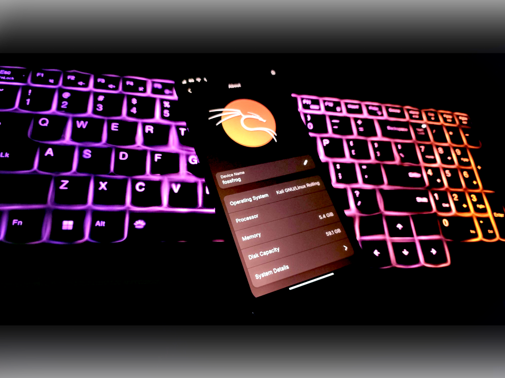

##### Kali NetHunter Pro is Pure Kali Linux for Mainline devices like PinePhone/Pro and QCOM Devices.



## Content:

- [Overview](#overview)
- [NetHunter Pro Supported Devices](#20-nethunter-pro-supported-devices)
- [Installing NetHunter Pro](#30-installing-nethunter-pro)

## Overview

Kali NetHunter Pro is an advanced, fully-featured version of Kali Linux specifically designed for ARM64 devices, such as the PinePhone, PinePhone Pro, and Qualcomm mainlined devices. Unlike the standard NetHunter, which runs as an overlay on Android, Kali NetHunter Pro is a pure Kali Linux distribution that brings the full power of desktop-class penetration testing to mobile platforms. It transforms compatible mobile devices into portable hacking machines by providing a complete Kali Linux experience without the limitations of running on top of an Android system. This enables professionals to perform penetration testing, security assessments, and other cybersecurity tasks directly from their mobile devices, with all the tools and features they would expect from a desktop environment.

What's in Kali NetHunter Pro?

- Almost every tool available that you use in your Kali desktop.

- Kali NetHunter Pro also provides Desktop Experience with HDMI out on supported devices like PinePhone and PinePhone Pro.

- Users can easily dualboot with other Operating Systems.

## 2.0 NetHunter Pro Supported Devices

NetHunter Pro is specifically designed to work seamlessly on a select range of ARM64 devices. Below are the Kali NetHunter Pro supported devices:

- PinePhone
- PinePhone Pro
- Poco F1 (beryllium)
- OnePlus 6 (enchilada)
- OnePlus 6T (fajita)
- Xiaomi Mi MIX 2S (polaris)
- SHIFT SHIFT6mq (axolotl)

## 3.0 Installing NetHunter Pro

Official release of Kali NetHunter Pro images for supported devices can be downloaded from the Kali Linux page located at the following URL:

- [kali.org/get-kali/](/get-kali/)

##### Installation steps for PinePhone/Pro Devices

```console
$ tar -xpf kali-nethunterpro-2025.2-pinephone-phosh.img.tar.xz
$ dd if=kali-nethunterpro-2025.2-pinephone-phosh.img of=/dev/mmcblkX bs=1M oflag=sync status=progress
```

##### Installation steps for QCOM Android Devices



```console
# Install on SDCard:
$ tar -xpf kali-nethunterpro-2025.2-sdm845.tar.xz
$ simg2img flash userdata nethunterpro-*-sdm845*rootfs.img rootfs_ext4.img
$ dd if=rootfs_ext4.img of={sdcard_block_device} bs=1M oflag=sync status=progress
$ fastboot flash boot nethunterpro*boot-{model}-{variant}.img
$ fastboot erase dtbo # if your device has dtbo partition

# Install on EMMC (fastboot method):
$ tar -xpf kali-nethunterpro-2025.2-sdm845.tar.xz
$ fastboot flash userdata nethunterpro-*-sdm845*rootfs.img
$ fastboot flash boot nethunterpro*boot-{model}-{variant}.img
$ fastboot erase dtbo # if your device has dtbo partition
```

##### Note:

- If your device has A/B partitions, you can choose the slot while flashing, e.g., `fastboot flash boot_a nethunterpro*boot-{model}-{variant}.img`.
- Run `fastboot getvar current-slot` to get the active slot in fastboot.
- Run `fastboot set_active {a or b}` to change the active slot.
- Do not forget to erase the dtbo before booting.
