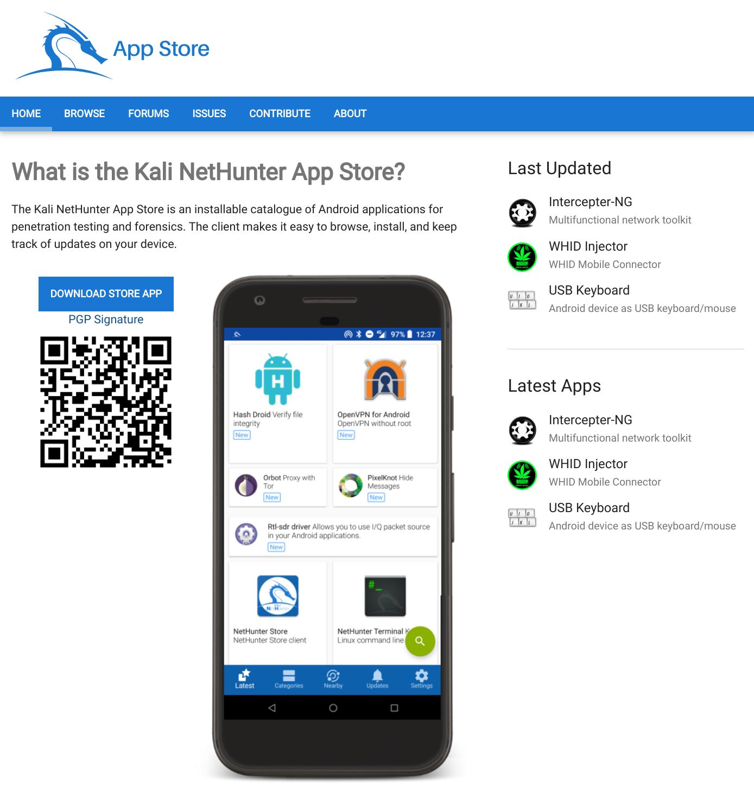
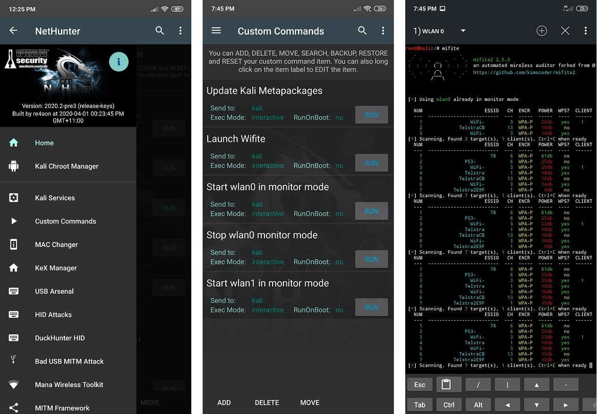

**Kali NetHunter is a free & Open-source **Mobile Penetration Testing Platform** for Android devices, based on Kali Linux.**

## Overview

Kali NetHunter is available for un-rooted devices (NetHunter Rootless), for rooted devices that have a custom recovery (NetHunter Lite), and for rooted devices for which a NetHunter specific kernel is available (NetHunter).

The core of Kali NetHunter, which is included in all three editions, comprises of:

- Kali Linux container that includes all the tools and applications that Kali Linux provides

- Kali NetHunter App Store with dozens of purpose-built security apps

- Android client to access the Kali NetHunter App Store

- Kali NetHunter Desktop Experience (KeX) to run full Kali Linux desktop sessions with support for screen mirroring via HDMI or wireless screen casting

Figure 2: Kali NetHunter Desktop Experience (KeX) outputting to an HDMI monitor

The Kali NetHunter App Store can be accessed through the dedicated client app or via the web interface.

**As today 31 march 2026, the store is outdated and not well maintened. We are planning to make a fresh new store from scratch and will start working on it soon. Users may experience issue about "privileged extension", if this happen you may want to go in the nh store settings, enabled advanced settings and un check the "privileged extension" check box.**

Figure 3: Kali NetHunter App Store

**Both rooted editions provide additional tools & services**.
A custom kernel can extend that functionality by adding additional network and USB gadget drivers as well as Wi-Fi injection support for selected Wi-Fi chips.

Figure 4: The Kali NetHunter App is available in both rooted editions (NetHunter Lite & NetHunter).

Beyond the [penetration testing tools](/tools/) included in Kali Linux, NetHunter also supports several additional classes, such as **HID Keyboard Attacks**, **BadUSB attacks**, **Evil AP MANA attacks**, and many more.

For more information about the moving parts that make up NetHunter, check out our [NetHunter Components](/docs/nethunter/nethunter-components/) page. Kali NetHunter is an [Open-source project](/docs/policy/kali-linux-open-source-policy/) developed by [Kali](/) and the community.

## 1.0 NetHunter Editions

NetHunter can be installed on almost every Android device under the sun using one of the following editions:

| Edition            | Usage                                                        |
| ------------------ | ------------------------------------------------------------ |
| NetHunter Rootless | The core of NetHunter for unrooted, unmodified devices       |
| NetHunter Lite     | The full NetHunter package for rooted phones without a custom kernel. |
| NetHunter          | The full NetHunter package with custom kernel for supported devices |

The following table illustrates the differences in functionality:

|      Feature       | NetHunter Rootless | NetHunter Lite | NetHunter |
| :----------------: | :----------------: | :------------: | :-------: |
|     App Store      |        Yes         |      Yes       |    Yes    |
|      Kali cli      |        Yes         |      Yes       |    Yes    |
| All Kali packages  |        Yes         |      Yes       |    Yes    |
|        KeX         |        Yes         |      Yes       |    Yes    |
| Metasploit w/o DB  |        Yes         |      Yes       |    Yes    |
| Metasploit with DB |         No         |      Yes       |    Yes    |
|   NetHunter App    |         No         |      Yes       |    Yes    |
|   Requires Root    |         No         |      Yes       |    Yes    |
|  Wi-Fi Injection   |         No         |       No       |    Yes    |
|    HID attacks     |         No         |       No       |    Yes    |
|    BT Arsenal      |         No         |       No       |    Yes    |
|    CARsenal        |         No         |       No       |    Yes    |

The installation of NetHunter Rootless is documented here:
[NetHunter-Rootless](/docs/nethunter/nethunter-rootless/)

The NetHunter-App specific chapters are only applicable to the NetHunter & NetHunter Lite editions.

The Kernel specific chapters are only applicable to the NetHunter edition.

## 2.0 NetHunter Supported Devices and ROMs

NetHunter Lite can be installed on all Android devices that are rooted using Magisk (you may try ksu but it's not officially supported).
The full NetHunter experience requires a devices specific kernel that has been purpose built for Kali NetHunter.
The [NetHunter GitLab repository](https://gitlab.com/kalilinux/nethunter) contains over 250 kernels for over 110 devices. Kali Linux publishes images for the most popular devices on the [NetHunter download page](/get-kali/).
The following live reports are generated automatically by GitLab CI:

- [List of quarterly published official NetHunter images](https://nethunter.kali.org/images.html)
- [List of all NetHunter supported kernels](https://nethunter.kali.org/kernels.html)
- [List of devices which NetHunter can be put on](https://nethunter.kali.org/device-kernels.html)

## 3.0 Downloading NetHunter

Official release NetHunter images for your specific supported device can be download from the Kali Linux page located at the following URL:

- [kali.org/get-kali/](/get-kali/)
- [Weekly builds](https://image-nethunter.kali.org/nethunter-installer/kali-weekly/)
- [Daily builds](https://image-nethunter.kali.org/nethunter-installer/kali-daily/)

Once the zip file has downloaded, verify the SHA256 sum of the NetHunter zip image against the values on the download page. If the SHA256 sums do not match, do not attempt to continue with the installation procedure.

## 4.0 Building NetHunter

Those of you who want to build a NetHunter image from our GitLab repository may do so using our Python build scripts. Check out our [Building NetHunter](/docs/nethunter/building-nethunter/) page for more information.
You can find additional instructions on using the NetHunter installer builder or adding your own device in the [README](https://gitlab.com/kalilinux/nethunter/build-scripts/kali-nethunter-installer/-/blob/main/README.md) located in the [nethunter-installer](https://gitlab.com/kalilinux/nethunter/build-scripts/kali-nethunter-installer) git repository.

## 5.0 Installing NetHunter on top of Android

Now that you've either downloaded a NetHunter image or built one yourself, the next steps are to prepare your Android device and then install the image. "Preparing your Android device" includes:

- **unlocking** your device and **updating it to stock** AOSP or LineageOS (CM). (Check point [2.0](#20-nethunter-supported-devices-and-roms) for supported roms).
- **installing [Magisk](https://github.com/topjohnwu/Magisk)** to root the device.
- Flash nethunter in Magisk and thats it!

- [Detailed intructions](/docs/nethunter/installing-nethunter/)

## 6.0 Post Installation Setup

- Open the NetHunter App and give required permissions.
- Start the Kali Chroot Manager.
- Install the Hacker Keyboard from the NetHunter Store using the NetHunter Store app.
- Install any other apps from the NetHunter Store as required.
- Configure Kali Services, such as SSH.
- Set up custom commands.
- Initialize the Exploit-Database.

## 7.0 Kali NetHunter Application

This is an Android APK that contains most of the Kali Nethunter userspace tools. It includes status information and tools to manage Nethunter itself (the kernel and the chroot), tools to  as well as a bunch of tools and attacks.

Attacks will be greyed out if the chroot is not running. Some of the attacks will prompt you to download additional requirements on first use.

### Nethunter management

- [**Home Screen**](/docs/nethunter/nethunter-home-screen/) - General information panel, network interfaces and HID device status.
- [**Kali Chroot Manager**](/docs/nethunter/nethunter-chroot-manager/) - For managing chroot metapackage installations.
- [**Settings**](/docs/nethunter/nethunter-settings/) - Select bootanimation, and modify various settings.
- [**Kernel**](/docs/nethunter/nethunter-kernel/) - Search, download, and flash kernel
- [**Modules**](/docs/nethunter/nethunter-modules/) - Load modules

### Tools

- [**Kali Services**](/docs/nethunter/nethunter-kali-services/) - Start / stop various chrooted services. Enable or disable them at boot time.
- [**Custom Commands**](/docs/nethunter/nethunter-custom-commands/) - Add your own custom commands and functions to the launcher.

### Attacks

- [**KeX Manager**](/docs/nethunter/nethunter-kex-manager/) - Set up an instant VNC session with your Kali chroot.
- [**MAC Changer**](/docs/nethunter/nethunter-mac-changer/) - Change your Wi-Fi MAC address (only on certain devices)
- [**Audio Manager**](/docs/nethunter/nethunter-audio/) - Enable audio for KeX.
- [**USB Arsenal**](/docs/nethunter/nethunter-usbarsenal/) - Control the USB gadget configurations.
- [**HID Attacks**](/docs/nethunter/nethunter-hid-attacks/) - Various HID attacks, Teensy style.
- [**DuckHunter HID**](/docs/nethunter/nethunter-duckhunter/) - Rubber Ducky style HID attacks.
- [**BadUSB MITM Attack**](/docs/nethunter/nethunter-badusb/) - Nuff said.
- [**Wifipumpkin**](/docs/nethunter/nethunter-wifipumpkin/) - Setup a malicious Access Point with captive portal at the click of a button.
- [**WPS Attacks**](/docs/nethunter/nethunter-wps/) - WPS attacks using OneShot.
- [**Bluetooth Arsenal**](/docs/nethunter/nethunter-btarsenal/) - Recon, spoof, listen to or inject audio to various Bluetooth devices.
- [**Social Engineer Toolkit**](/docs/nethunter/nethunter-set/) - Build your own phishing email template for Social Engineer Toolkit.
- [**NMap Scan**](/docs/nethunter/nethunter-nmap/) - Quick Nmap scanner interface.
- [**Metasploit Payload Generator**](/docs/nethunter/nethunter-mpg/) - Generating Metasploit payloads on the fly.
- [**Searchsploit**](/docs/nethunter/nethunter-searchsploit/) - Easy searching for exploits in [Exploit-Database](https://www.exploit-db.com/).
- **Pineapple Connector** - Provide Wi-Fi via Android for a Hak5 WiFi Pineapple over USB
- [**Wardriving**](/docs/nethunter/nethunter-wardriving/) - Passively sniff nearby Wi-Fi networks
- [**CARsenal**](/docs/nethunter/nethunter-carsenal/) - Automotive Security tools.

## 8.0 Porting NetHunter to New Devices

If you're interested in porting NetHunter to other Android devices, check out the following links. If your port works, make sure to tell us about it so we can include these kernels in our releases!

1. [Getting Started manually](/docs/nethunter/porting-nethunter/)
2. [Getting Started with kernel builder](/docs/nethunter/porting-nethunter-kernel-builder/)
3. [Patching a Kernel](/docs/nethunter/nethunter-kernel-1-patching/)
4. [Configuring a Kernel](/docs/nethunter/nethunter-kernel-2-config-1/)
5. [Adding Your Device](https://gitlab.com/kalilinux/nethunter/build-scripts/kali-nethunter-kernels)

Other resources recommended by Nethunter team :

1. [Yesimxev Nethunter Kernel Porting Guide Youtube Video](https://www.youtube.com/watch?v=FwSHbZqY88k) recommended to watch alongside [Getting Started with kernel builder](/docs/nethunter/porting-nethunter-kernel-builder/)
2. [Akabulous Deep Kernel Porting Guide](https://gitlab.com/akabulous/So_You_Want_To_Build_A_Nethunter_Kernel)
3. [R0ttenBeef Kernel Porting Guide](https://r0ttenbeef.github.io/Port-Custom-Build-of-Kali-Nethunter-to-an-Unsupported-Phone-Walkthrough/)
## 9.0 Known Working Hardware

1. [Wireless Cards](/docs/nethunter/wireless-cards/)
2. SDR - RTL-SDR (based on RTL2832U)
3. Bluetooth adapters - Sena UD100, TP-Link UB500, generic CSR4.0 adapter
4. CARsenal - [CAN USB Analyser](https://www.seeedstudio.com/USB-CAN-Analyzer-p-2888.html?srsltid=AfmBOooenIruMfjueidDJ9TK8t6e8ihd3wuCCV0i7e2YQfTTSBDhfyYw), [CANable USB](https://openlightlabs.com/), [ELM327 Adapter](www.carscanner.info/choosing-obdii-adapter/), [MCP25XX CAN Module](https://www.seeedstudio.com/I2C-CAN-Bus-Module-p-5054.html?srsltid=AfmBOorQK745b5IMop1r_Gmledh6YLwc1VlqrpDMOnUxBGrA6iCpLiEb).

About CARsenal adapters. All the recommended hardware as been tested and find out working. Clone from ali express MAY or MAY NOT work, i personally got clone for all of them and got these working excepted for ELM327 which was detected as clone by feediag and wasnt returning successfull connection with the car. Anyway i still recommend official product if you can afford these. Other recommendation may come with time.

## 10.0 NetHunter Apps

- [**NetHunter Terminal Application**](/docs/nethunter/nethunter-terminal/)
- [**NetHunter KeX Application**](/docs/nethunter/nethunter-kex/)

## 11.0 Useful Links

1. The NetHunter Store App can be downloaded [here](https://store.nethunter.com/NetHunterStore.apk)
2. The NetHunter Web Store can be found [here](https://store.nethunter.com/)
3. The source code for building the NetHunter Apps can be found on GitLab [here](https://gitlab.com/kalilinux/nethunter/apps)
