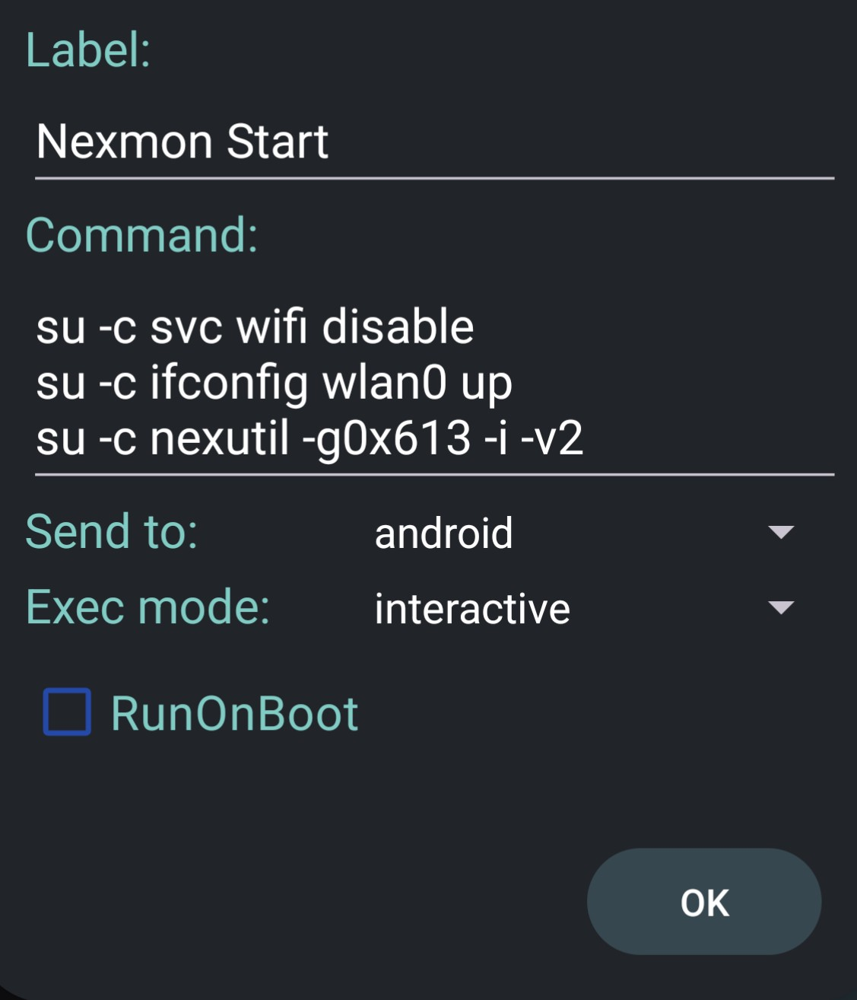

# Informations

> This installation guide and files used is for Samsung Galaxy S10 Exynos9820 version.

## Features

| Feature  | Supported |
| :--------------- | -----:|
| BT_RFCOMM | ✅ |
| INTERNAL_BT | ✅ |
| RTL_BT | ✅ |
| HID-4 | ✅ |
| Injection | ✅ |
| ATH9K_HTC | ✅ |
| RTL88XX | ✅ |
| RTL8188EUS (Module) | ✅ |
| NFS | ✅ |
| CAN (optional modules included) | ✅ |
| Nexmon Monitor | ✅ |
| Nexmon Injection | ✅ |
| WiFi 5Ghz | ✅ |

> All the configuration that can be found in porting guide has been applied.

## Supported Version

| ROM  | Status |
| :--------------- | -----:|
| <a href="https://github.com/V0lk3n/nethunter_kernel_samsung_exynos9820/tree/nethunter-lineage-21">LineageOS 21 (A14)</a> | Old |
| <a href="https://github.com/V0lk3n/nethunter_kernel_samsung_exynos9820/tree/nethunter-lineage-22.1">LineageOS 22.1 (A15)</a> | Old |
| <a href="https://github.com/V0lk3n/nethunter_kernel_samsung_exynos9820/tree/nethunter-lineage-22.2">LineageOS 22.2 (A15)</a> | Recommended |

> This guide will use LineageOS 22.2

# Installation

Let's start installation. You will walk through the following steps :
- OEM Unlocking
- Flash LineageOS and Recovery
- Root the device
- Install Magisk Modules
- Flash Kali Nethunter and it's kernel
- Flash bootloader removing warning at boot
- Final tweaks and troubleshooting

## OEM Unlocking

To unlock OEM you first need to enable Developer mode.

Open "Settings > About phone > Software Information", then spam click on "Build Number" until enabling Developer Mode.

Developer Mode should appear in "Settings".

Inside Developer Mode, search for OEM unlocking option and enable it. Go into fastboot, long press on "Vol+" then "Vol+" to accept OEM unlocking and wipe the phone.

> If you dont see OEM Unlocking option, you can try some workaround like modify Date/Time of the device. Feel free to search on google about this.


## USB Debugging

Boot your device, configure it. Enable Developer Mode again.

Open "Settings > About phone > Software Information", then spam click on "Build Number" until enabling Developer Mode.

Inside Developer Mode, enable USB Debugging.


## ROM Flashing

Download LineageOS build, Recovery and MindTheGapps.

LineageOS 22.2 : <a href="https://github.com/V0lk3n/nethunter_kernel_samsung_exynos9820/releases/download/nethunter-22.2/lineage-22.2-20250627-nightly-beyond1lte-signed.zip">Download</a>

Recovery : <a href="https://github.com/V0lk3n/nethunter_kernel_samsung_exynos9820/releases/download/nethunter-22.2/recovery.img">Download</a>

MindTheGapps : <a href="https://github.com/V0lk3n/nethunter_kernel_samsung_exynos9820/releases/download/nethunter-22.2/MindTheGapps-15.0.0-arm64-20250214_082511.zip">Download</a>

### Flash Recovery

Boot your device in Download mode. And flash recovery using Heimdall, you can follow the <a href="https://wiki.lineageos.org/devices/beyond1lte/install/#preparing-for-installation">LineageOS install guide</a> for that part.

```bash
heimdall flash --RECOVERY recovery.img --no-reboot
```
> If you come from Stock ROM, you may need to flash VBMETA as well, boot back to Download mode and flash vbmeta using heimdall
>
> vbmeta : <a href="https://github.com/V0lk3n/nethunter_kernel_samsung_exynos9820/releases/download/nethunter-22.2/vbmeta.img">Download</a>
>
>```bash
> heimdall flash --VBMETA vbmeta.img --no-reboot
>```

### Flash LineageOS ROM

Once the recovery flashed, shutdown your device by holding "Vol- and Power key" for 7 seconds, and then directly boot to recovery by holding "Vol+, Bixby and Power key".

Once booted into Recovery, navigate to "Factory reset" and Format everything.

Go back, and navigate to "Apply update > Apply from ADB" and flash LineageOS build using adb sideload.

```bash
adb -d sideload lineage-22.2-20250627-nightly-beyond1lte-signed.zip
```

Now flash MindTheGapps, "Apply update > Apply from ADB".

```bash
adb -d sideload MindTheGapps-15.0.0-arm64-20250214_082511.zip
```

You will have a warning on your phone saying "Signature verification failed Install anyway?" press "Yes", and wait for MindTheGapps flashing to complete.

Once finished, press "Reboot System Now" and configure your device. Connect to WiFi (needed for rooting step).

Enable Developer Mode again.

Open "Settings > About phone > Software Information", then spam click on "Build Number" until enabling Developer Mode.

Inside Developer Mode, enable USB Debugging.

> For a better and easier experience i suggest to enable advanced reboot "System > Button > Power Menu > Advanced Reboot". This is a great way to boot in Download/Recovery when needed.


## Rooting

Download Magisk 28.1.

> At time of writting this guide, the latest Magisk is 29 but it come with a lot of issue for nethunter. Thats why you should use 28.1 instead.

Magisk 28.1 : <a href="https://github.com/V0lk3n/nethunter_kernel_samsung_exynos9820/releases/download/nethunter-22.2/Magisk-v28.1.zip">Download</a>

Reboot to recovery and navigate to "Apply update > Apply from ADB" and flash Magisk.

```bash
adb -d sideload Magisk-v28.1.zip
```

You will have a warning on your phone saying "Signature verification failed Install anyway?" press "Yes", and wait for Magisk flashing to complete.

Once flashing complete, reboot to system and open Magisk app.

It will prompt to finish the installation, say yes and chose "Direct Installation" as methode.

When finished, reboot.

## Magisk Module

Download Magisk Overlayfs module.

Magisk Overlayfs : <a href="https://github.com/V0lk3n/nethunter_kernel_samsung_exynos9820/releases/download/nethunter-22.2/magisk-overlayfs-release.zip">Download</a>

Download PlayIntegrityFix module.

PlayIntegrityFix : <a href="https://github.com/V0lk3n/nethunter_kernel_samsung_exynos9820/releases/download/nethunter-22.2/PlayIntegrityFix_v3.3-inject-manual.zip">Download</a>

Push the package to your android device.

```bash
adb push magisk-overlayfs-release.zip /sdcard/
adb push PlayIntegrityFix_v3.3-inject-manual.zip /sdcard/
```

Open magisk, navigate to "Modules > Install from storage" and select Magisk Overlayfs module. Press "Ok" to install and reboot once install complete.

Open magisk again, then in settings enable "Zygisk".

Navigate to "Modules > Install from storage" and select PlayIntegrityFix module. Press "Ok" to install and reboot once install complete.


## Nethunter

My favorite way is to build installer myself. But you may also <a href="https://kali.download/nethunter-images/kali-2025.2/kali-nethunter-2025.2-beyond1lte-los-fifteen-full.zip">download it</a> if you wish to.

First let's build from source.

```bash
# Clone and setup kali-nethunter-installer
$ git clone https://gitlab.com/kalilinux/nethunter/build-scripts/kali-nethunter-installer.git
$ cd kali-nethunter-installer
$ ./bootstrap.sh
[?] Would you like to grab the full history of kernels? (y/N):
[?] Would you like to use SSH authentication (faster, but requires a GitLab account with SSH keys)? (y/N): N
[i] Running command: git clone --depth 1 https://gitlab.com/kalilinux/nethunter/build-scripts/kali-nethunter-kernels.git kernels
Cloning into 'kernels'...

# Build full installer
## LOS 21
$ ./build.py -k beyond1lte-los -14 -fs full
## LOS 22.1
$ ./build.py -k beyond1lte-los -15 -fs full
## LOS 22.2
$ ./build.py -k beyond1lte-los-22.2 -15 -fs full

# Build Kernel Only
## LOS 21
$ ./build.py -k beyond1lte-los -14 -i
## LOS 22.1
$ ./build.py -k beyond1lte-los -15 -i
## LOS 22.2
$ ./build.py -k beyond1lte-los-22.2 -15 -i
```

Push installer to your device.

```bash
adb push nethunter-20250629_171321-beyond1lte-los-fifteen-kalifs_full.zip /sdcard/
```

Open Magisk, navigate to "Modules > Install from Storage", selecte nethunter installer and install it.

Wait for nethunter installation to finish, and reboot when prompted.

### Flash Kernel on Recovery - Optional but Recommended

I recommend also to reboot to Recovery, and flash Kernel Only.

Reboot to recovery and navigate to "Apply update > Apply from ADB" and flash Nethunter Kernel.

```bash
adb -d sideload kernel-nethunter-20250629_173026-beyond1lte-los-fifteen.zip
```

You will have a warning on your phone saying "Signature verification failed Install anyway?" press "Yes", and wait for Nethunter Kernel flashing to complete.

Once flashing complete, reboot to system

## Nexmon

### Nexmon Setup

Download Nexmon Magisk module by <a href="https://gitlab.com/yesimxev">yesimxev</a>.

Nexmon S10 : <a href="https://github.com/V0lk3n/nethunter_kernel_samsung_exynos9820/releases/download/nethunter-22.2/nexmon-s10.zip">Download</a>

Push the module to your device.

```bash
adb push nexmon-s10.zip /sdcard/
```

Open Magisk, navigate to "Modules > Install from Storage" and selecte Nexmon S10 module.

Wait for installation to complete and reboot your phone.

### Nexmon Usage

Start Monitor mode

```bash
$ svc wifi disable
$ ifconfig wlan0 up
$ nexutil -g0x613 -i -v2
```

You can make custom command to make that setup easier.



Stop Monitor mode

```bash
$ nexutil -m0
$ svc wifi enable
```

### Hijacker Setup

You should turn off WiFi before openning Hijacker app.

Open Hijacker app and configure the following Settings.

| Settings  | Value |
| :--------------- | -----:|
| Prefix | LD_PRELOAD=/data/user/0/com.hijacker/files/lib/libnexmon.so |
| Enable Monitor Mode | ifconfig wlan0 up; nexutil -g0x613 -i -v2 |
| Disable Monitor Mode | nexutil -m0 |
| Start Monitor Mode on Airodump Start | ✅ |
| Band | Both |


# Bonus : Flash splashscreen

Boot warning can be annoying, you probably wish to flash a custom one to get rid of theses warnings.

<a href="https://xdaforums.com/t/g97xf-soldier9312s-splash-screen-changer-1-0-13-05-2019.3929748/">XDA Thread</a>

<a href="https://androidfilehost.com/?w=files&flid=293633">Download</a>

Chose and Download the desired Splash Screen.

Boot to Recovery and navigate to "Apply update > Apply from ADB" and flash splash screen using adb sideload.

```bash
adb -d sideload G97X_Splash_Screen_Changer_by_SoLdieR9312_splash.zip
```

Wait flashing to complete and reboot your phone.

# Troubleshooting

## Fix modules

Modules may need to be manually pushed.

You can find the modules inside the nethunter installer zip 

```bash
nethunter-20250629_171321-beyond1lte-los-fifteen-kalifs_full.zip/kernel-nethunter.zip/modules/system/lib/modules
```

Extract "modules" folder to your computer and push it in /sdcard/

```bash
# From Computer using ADB
adb push modules /sdcard/
```

From your phone, open Nethunter Terminal, press the three dot "New Session... > New Root Shell"

> Mount from Nethunter Android Root Terminal, not from adb shell, overlayfs will not allow to mount from there.

Mount /system/lib

```bash
# From NH Android Root Terminal
mount -o rw,remount /system/lib
```

Move modules from /sdcard to /system/lib.

```bash
# From NH Android Root Terminal
mv /sdcard/modules /system/lib
```

## Fix GPS

Install Google Maps and open it, use the functionallity to locate you and give the permission requested.

Using adb or Android Root Shell, give the location permission to gms.

```bash
adb root
adb shell pm grant com.google.android.gms android.permission.ACCESS_COARSE_LOCATION
adb shell pm grant com.google.android.gms android.permission.ACCESS_FINE_LOCATION
```

Confrim everything is working by looking at Nethunter app > Wardriving, if you see GPS coordination you are all set.

# Credits

Special thanks to :
- <a href="https://gitlab.com/yesimxev">Yesimxev</a> for help and support on Galaxy S10
- **Arti** for help and support on Galaxy S10
- <a href="https://github.com/seemoo-lab/nexmon">Nexmon</a>
- <a href="https://x.com/MarkusTieger">MarkusTieger</a> for nexmon