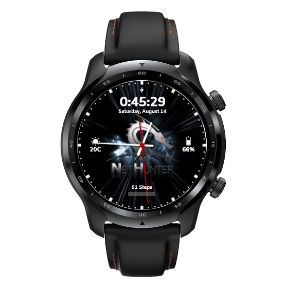

All variants are supported (TicWatch Pro 3 GPS/LTE/Ultra GPS/Ultra LTE).

# From unpacking to running NetHunter in 6 steps:

1. Unlock the bootloader
2. Revert to stock WearOS2
3. Flash TWRP, WearOS image, Magisk, dm-verity disabler
4. Finalise Magisk app to finish the rooting process
5. Install NetHunter
6. Set NetHunter watch face

## 1. Unlock the bootloader

- Connect your watch to your PC with a DIY USB cable or a [3D printed data dock](https://social.thangs.com/m/59021), and fire up a terminal.
- If you have set up your watch on the phone you can access settings, otherwise hold both buttons for a few seconds on the welcome screen.
- Enable developer settings by going to System -> About -> tap Build number 10 times
- Enable ADB, re-plug USB and accept debug from PC
- Reboot into bootloader with `adb reboot bootloader` from the terminal
- Unlock bootloader with `fastboot oem unlock`

## 2. Revert to stock WearOS2

Do this step **only** if you got your watch with WearOS3.

- Reboot to bootloader again, using one of the above methods
- Unpack stock WearOS2 zip (ROVER_STOCK_FASTBOOT_PMRL.220704.001.zip for LTE/Ultra LTE, RUBYFISH_STOCK_FASTBOOT_PMRB.220703.001.zip for GPS/Ultra GPS)
- Run flash_all.sh or flash_all.bat if using Windows
- Reboot and accept format data if required

## 3. Flash TWRP, OneOS image, Magisk, dm-verity disabler

Magisk **24.3** is recommended.
**OneOS** is recommended for wireless injection, as any added system files like nexmon firmware or libs will be replaced on Stock WearOS after reboot.
**UPDATE** Stock WearOS2 is now also supported thanks to the Nexmon Magisk module by [apk0mix5900](https://github.com/apk0mix5900).

- Again enable ADB, and reboot to bootloader with `adb reboot bootloader`
- Disable vbmeta verification: `fastboot --disable-verity --disable-verification flash vbmeta vbmeta.img`
- Flash recovery `fastboot flash recovery recovery.img`
- Boot into recovery by selecting it with the side buttons (switch with bottom one, select with upper button)
- Select Wipe -> Next page -> Advanced Wipe -> Format Data
- Reboot to recovery
- Select "Install -> ADB Sideload"
- If you want to keep stock WearOS, skip the next two steps
  - Flash OneOS with `adb sideload`
  - Flash Mobvoi Apps package with `adb sideload`
- If you have an Ultra, `adb sideload` the Ultra addon package (TWRP-OEM_FOR_TICWATCH_PRO_3_ULTRA(rover).zip for Ultra LTE, TWRP-OEM_FOR_TICWATCH_PRO_3_ULTRA_GPS(rubyfish).zip for Ultra GPS)
- Flash Magisk with `adb sideload Magisk-v24.3.apk`
- Copy and flash DM-Verity_ForceEncrypt Disabler with `adb push Disable-DM-Verity_ForceEncrypt.zip /sdcard/` and install via TWRP
- Reboot & do initial setup (pair with your phone through WearOS app)

## 4. Finalise Magisk app to finish rooting

- Enable ADB again
- Set density so app menu buttons will be reachable on OneOS `adb shell wm density 300`
- Finalise Magisk installation with app install `adb install Magisk-v24.3.apk`
- Launch Magisk Manager
- Find the settings button on top right corner (a bit tricky to reach)
- You may want to disable auto-update, set grant access in auto response, and disable toast notifications for easier navigation in the future

## 5. Install NetHunter

- Reboot to recovery
- Select Install -> ADB Sideload
- Flash NetHunter image with `adb sideload`
- Flash Magisk apk again with `adb sideload`
- Reboot
- Start NetHunter app & chroot (it may reboot after first start)
- Reboot

## 6. Set NetHunter watch face (optional)

- Install Facer onto your phone
- Unzip facer zip for wearos and install the contents using `adb install-multiple *.apk`
- Search for NetHunter on your phone
- Select & Sync

### Enjoy Kali NetHunter on the TicWatch Pro 3

## Downloads

- Build files:
  - [Magisk](https://kali.download/nethunter-images/devices/rubyfish/Magisk-v24.3.apk)
  - TWRP image for [rover](https://kali.download/nethunter-images/devices/rubyfish/rover_recovery.img) or [rubyfish](https://kali.download/nethunter-images/devices/rubyfish/rubyfish_recovery.img)
  - [vbmeta image](https://kali.download/nethunter-images/devices/rubyfish/vbmeta.img)
  - [dm-verity disabler](https://kali.download/nethunter-images/devices/rubyfish/Disable-DM-Verity_ForceEncrypt.zip)
  - [OneOS, Stock ROMs, Ultra addon and Mobvoi packages](https://kali.download/nethunter-images/devices/rubyfish/) _(optional)_
  - [TicWatch Pro 3 NetHunter zip](https://drive.google.com/file/d/19zTKPTbrBKFMH_pA0sWpD_7UK1zBJKjc/view?usp=sharing) - Daily 2026.2 kalifs with patched systemd, udev, and latest stable NetHunter app (2026.1)
  - [Facer app for WearOS 2](https://kali.download/nethunter-images/devices/rubyfish/facer_wearos.zip)

## Additional recommended apps

- [TotalCommander](https://www.totalcommander.ch/android/tcandroid323-armeabi.apk): useful for selecting eg. a Ducky script, use "adb install" method
- [Hijacker & Nexmon](https://github.com/apk0mix5900/nexmon-twp3-magisk/releases/download/1.0/nexmon-magisk-twp3.zip): install via Magisk

## Supported features

- Monitor mode with injection
- Kali services
- Custom Commands
- Bluetooth Arsenal
- KeX
- MAC Changer
- HID Attacks
- DuckHunter
- Nmap Scan
- WPS Attacks

## Upcoming features (not guaranteed)

- Router Keygen (to be optimised)
- Mifare Classic Tool (need to build OS with android.hardware.nfc enabled)

## Hardware limitations

- Power resource is not enough for any external adapters, although this kernel might support Y cable in the future!
