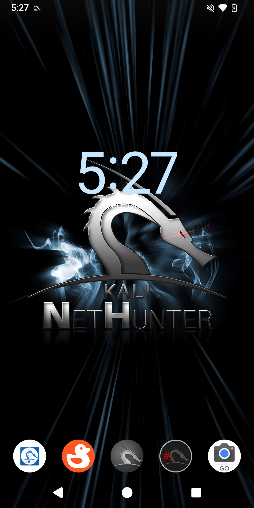

# From unpacking to running NetHunter in 5 steps:
1. Installing adb and fastboot
2. Unlock Bootloader
3. Flash PixelExperience Recovery and setup for LineageOS
4. Flash LineageOS 22.1 and Magisk 27
5. Install NetHunter

## 1. Installing adb and fastboot

```console
kali@kali:~$ sudo apt update
[...]
kali@kali:~$ sudo apt install adb fastboot
[...]
kali@kali:~$
```

## 2. Unlock Bootloader

1. Go to Settings -> About Phone then tap 7 times on "Build number" to enable "Developer options"
2. Go to Settings -> System -> Developer options and tap "OEM unlocking" then turn off device
3. Hold Volume Down and Power Buttons till you see "FASTBOOT" screen now plug device to PC
4. Open terminal and run `fastboot flashing unlock` and hold Volume Down then wait until "FASTBOOT" come back now run `fastboot flashing unlock_critical` if FASTBOOT screen will not appear after first command just repeat Step 3 after phone boot and use `fastboot flashing unlock_critical`
5. After reboot u should see "Unlocked" on boot screen

## 3. Flash PixelExperience Recovery and setup for LineageOS

1. Download [PixelExperience_jasmine_sprout-13.0-20231128-0727-OFFICIAL.img](https://dl.pixelexperience.org/Pv_GKKuO_pDekL3Rihvybqd4DfekyoAW1o9LIVdEaGr8FPg6WHy0Y_VBB_te3V0XxQS1SNFw9A-IJOFTcz2-EM_-0Dc6d8h58ei8V0v64zA=/PixelExperience_jasmine_sprout-13.0-20231128-0727-OFFICIAL.img)
2. Reboot device holding Volume Down till "FASTBOOT" screen appear and connect it to PC
3. Now open terminal and cd to directory where you downloaded `PixelExperience_jasmine_sprout-13.0-20231128-0727-OFFICIAL.img` and flash recovery like below
```console
kali@kali:~$ cd Downloads/
[...]
kali@kali:~/Downloads$ fastboot flash boot_a PixelExperience_jasmine_sprout-13.0-20231128-0727-OFFICIAL.img
[...]
kali@kali:~/Downloads$ fastboot flash boot_b PixelExperience_jasmine_sprout-13.0-20231128-0727-OFFICIAL.img
[...]
kali@kali:~/Downloads$
```
4. To reboot device to flashed recovery run `fastboot reboot` and hold Volume Up button until you see "RECOVERY" screen
5. Download the [copy-partitions-20210323_1922.zip](https://github.com/PixelExperience-Devices/blobs/blob/main/copy-partitions-20210323_1922.zip?raw=true)
6. On the device, select “Apply Update”, then “Apply from ADB” to begin sideload.
7. Now use `adb sideload copy-partitions-20210323_1922.zip`
8. Then reboot to recovery by tapping “Advanced”, then “Reboot to recovery”
9. Go to “Advanced” -> “Enter fastboot”
10. Download [super_empty.img](https://wiki-blobs-dl.pixelexperience.org/wiki_blobs_jasmine_sprout/main/android-13/super_empty.img)
11. And then in fastbootd [NOT FASTBOOT/BOOTLOADER] use `fastboot wipe-super super_empty.img` on pc
12. Now again reboot to recovery by tapping “Advanced”, then “Reboot to recovery”

## 4. Flash LineageOS 22.1 and Magisk 27
1. Tap "Apply update" then tap "Apply from ADB"
2. Download [LineageOS-22.1-jasmine-sprout.zip](https://drive.google.com/file/d/1PjuRpYekRjYiMBaS23ZxJx7YhkcUBdW9/view?usp=drive_link)
3. Flash LineageOS 22.1
```console
kali@kali:~/Downloads$ adb devices
* daemon not running; starting now at tcp:5037
* daemon started successfully
List of devices attached
dea044c9    sideload

kali@kali:~/Downloads$ adb sideload LineageOS-22.1-jasmine-sprout.zip
[...]
kali@kali:~/Downloads$
```
4. Now wait for LineageOS to install if some error appear just tap "Yes"
5. When it is installed tap "Reboot system now"
6. Now setup your device like any android phone
7. When you finished setting up your device reboot it and hold Volume Up
8. If you see "RECOVERY" screen tap "Apply update" -> "Apply from ADB"
9. Download [Magisk-v27.apk](https://github.com/topjohnwu/Magisk/releases/download/v27.0/Magisk-v27.0.apk)
10. Flash Magisk
```console
kali@kali:~/Downloads$ adb devices
dea044c9    sideload

kali@kali:~/Downloads$ adb sideload Magisk-v27.apk
[...]
kali@kali:~/Downloads$
```
11. Reboot Device and open newly installed app "Magisk" and setup it with instructions on screen

## 5. Install NetHunter

1. Download [kali-nethunter-2026.1-jasmine-sprout-los-fifteen-full.zip](https://kali.download/nethunter-images/kali-2026.1/kali-nethunter-2026.1-jasmine-sprout-los-fifteen-full.zip)
2. Copy it from PC to device
3. Open Magisk app, Modules -> Install from storage and select "kali-nethunter-2026.1-jasmine-sprout-los-fifteen-full.zip"
4. Then wait for installation to end, now tap "Reboot System"
5. When phone starts you will see Kali Bootanimation
### Enjoy Kali NetHunter on the Xiaomi Mi A2

Please help with the development by submitting issues and pull requests. We much appreciate it.

## Troubleshooting 

### Broken SSH
- Use `ssh-keygen -A` in nethunter terminal
### Broken APT 
1. Use `echo 'APT::Sandbox::User "root";' > /etc/apt/apt.conf.d/01-android-nosandbox` in nethunter terminal
2. Use `groupadd -g 3003 aid_inet && usermod -G nogroup -g aid_inet _apt` in nethunter terminal
Credit: [yesimxev](https://gitlab.com/kalilinux/nethunter/build-scripts/kali-nethunter-project/-/work_items/1528#note_1423179988)
### Broken Ctrl+C
Happens on newer Magisk Version so use 27
