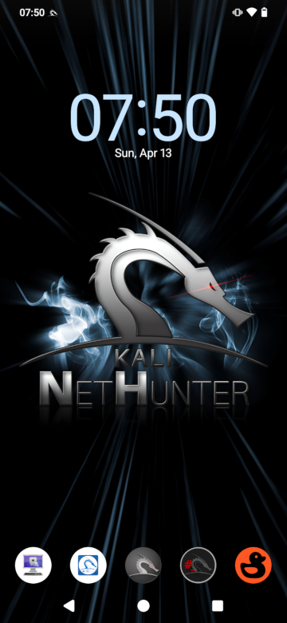

# From unpacking to running NetHunter in 4 steps:
1. Installing adb and fastboot
2. Unlock Bootloader
3. Flash LineageOS Recovery and LineageOS 22 and Magisk
4. Install NetHunter

## 1. Installing adb and fastboot

```console
kali@kali:~$ sudo apt update
[...]
kali@kali:~$ sudo apt install adb fastboot
[...]
kali@kali:~$
```

## 2. Unlock Bootloader

1. Go to Settings -> About Phone then tap 7 times on "Build number" to enable "Developer options"
2. Go to Settings -> System -> Developer options and tap "OEM unlocking" then turn off device
3. Hold Volume Down and Power Buttons till you see "FASTBOOT" screen now plug device to PC
4. Open terminal and run `fastboot flashing unlock` and hold Volume Down then wait until "FASTBOOT" come back now run `fastboot flashing unlock_critical`
5. After reboot u should see "Unlocked" on boot screen

## 3. Flash LineageOS Recovery and LineageOS 22 and Magisk

1. Download [boot_los22.img](https://thebiggestboi.skyblueborb.workers.dev/0:/boot_los22.img)
2. Reboot device holding Volume Down till "FASTBOOT" screen appear and connect it to PC
3. Now open terminal and cd to directory where you downloaded boot_los22.img and flash recovery like below
```console
kali@kali:~$ cd Downloads/
[...]
kali@kali:~/Downloads$ fastboot flash boot_a boot_los22.img
[...]
kali@kali:~/Downloads$ fastboot flash boot_b boot_los22.img
[...]
kali@kali:~/Downloads$
```
4. To reboot device to flashed recovery run `fastboot reboot` and hold Volume Up button until you see "RECOVERY" screen
5. Tap "Apply update" then tap "Apply from ADB"
6. Download [lineage-22.0-20241114-UNOFFICIAL-laurel_sprout.zip](https://thebiggestboi.skyblueborb.workers.dev/0:/lineage-22.0-20241114-UNOFFICIAL-laurel_sprout.zip)
7. Flash LineageOS 22
```console
kali@kali:~/Downloads$ adb devices
* daemon not running; starting now at tcp:5037
* daemon started successfully
List of devices attached
dea044c9    sideload

kali@kali:~/Downloads$ adb sideload lineage-22.0-20241114-UNOFFICIAL-laurel_sprout.zip
[...]
kali@kali:~/Downloads$
```
8. Now wait for LineageOS to install if some error appear just tap "Yes"
9. When it is installed tap "Reboot system now"
10. Now setup your device like any android phone
11. When you finished setting up your device reboot it and hold Volume Up
12. If you see "RECOVERY" screen tap "Apply update" -> "Apply from ADB"
13. Download [Magisk-v28.1.apk](https://github.com/topjohnwu/Magisk/releases/download/v28.1/Magisk-v28.1.apk)
14. Flash Magisk
```console
kali@kali:~/Downloads$ adb devices
dea044c9    sideload

kali@kali:~/Downloads$ adb sideload Magisk-v28.1.apk
[...]
kali@kali:~/Downloads$
```
15. Reboot Device and open newly installed app "Magisk" and setup it with instructions on screen

## 4. Install NetHunter

1. Download [kali-nethunter-2025.4-laurel-sprout-los-fifteen-full.zip](https://kali.download/nethunter-images/kali-2025.4/kali-nethunter-2025.4-laurel-sprout-los-fifteen-full.zip)
2. Copy it from PC to device
3. Open Magisk app, Modules -> Install from storage and select "kali-nethunter-2025.4-laurel-sprout-los-fifteen-full.zip"
4. Then wait for installation to end, now tap "Reboot System"
5. When phone starts you will see Kali Bootanimation
### Enjoy Kali NetHunter on the Xiaomi Mi A3


Please help with the development by submitting issues and pull requests. We much appreciate it.
