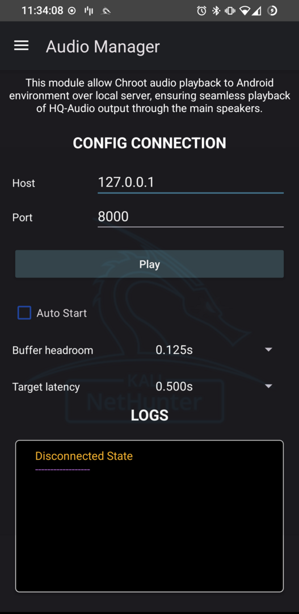

Introduction
This modules enables Audio in KeX session.

Here is the step-by-step instructions for setting up and using the Audio Manager with Kali NetHunter.

Follow the steps carefully to enable live audio streaming while using the Kali NetHunter GUI interface.

Step 1: One-Time Setup

1. Open Kali NetHunter

Launch the Kali NetHunter app on your device.

2. Go to KeX Manager

Inside the app, navigate to the KeX Manager.

3. Setup Server (if any)

Set up the KeX server for your desired user.

Step 2: Start the Server

1. Go Back to KeX Manager

Return to the Kali NetHunter app and open the KeX Manager again.

2. Run the Server

Start the KeX server for your chosen user by selecting "Run Server."

Step 3: Enable Audio Server

1. Enable Audio Server

Once the KeX server is running, go back and enable Audio from the KeX Manager.

Step 4: Configure Audio Manager

1. Open Audio Manager

Open the Audio Manager on your device.

2. Set IP and Port

Enter the following details in Audio Manager (default settings):

IP: 127.0.0.1

Port: 8000

3. Click Play

Press the Play button.

You will either see an error message or a success message based on the connection status.

Step 5: Access the GUI Interface

1. Go to KeX Client

Open the KeX Client.

2. Start GUI Interface

You can now use the GUI Interface for Kali.

3. Enjoy Live Audio Streaming

If everything is set up correctly, you will have live audio streaming from the system.

Conclusion

Following these steps ensures that your Kali NetHunter setup is complete with an active audio stream. Enjoy using the Audio Manager for seamless sound integration while working within the NetHunter environment.

