CARsenal is used to provide a suite of Car Hacking tools!

## Prerequisite - Kernel Modification

Your kernel should have CAN support enabled. For more informations, follow <a href="https://www.kali.org/docs/nethunter/nethunter-kernel-9-config-8/">"Configuring the Kernel - CARsenal"</a> documentation.

## Menu

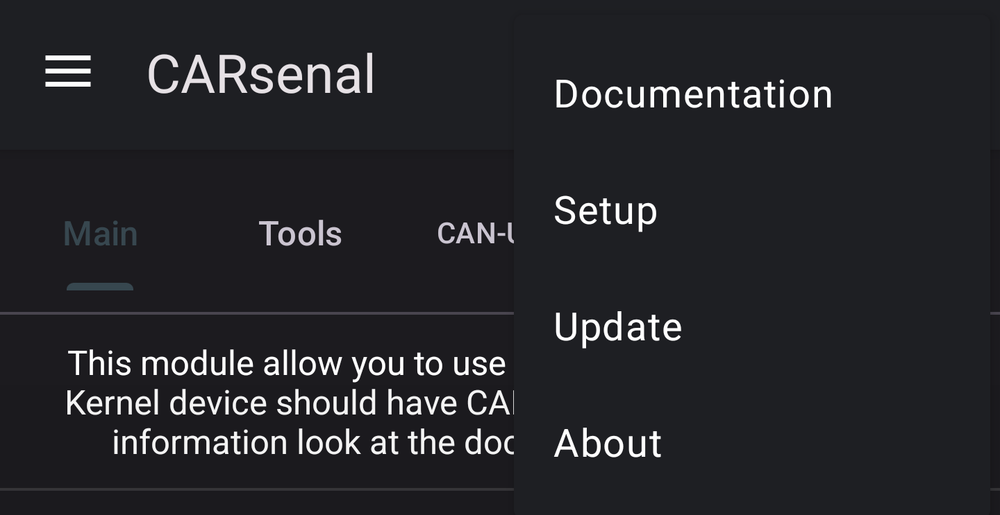

### Documentation

This button redirect to the following documentation.

### Setup

This button install needed CAN tools and packages. Note that it shouldn't be needed as it should be launched at first run of CARsenal.

### Update

This button update the installed CAN tools and packages.

### About

This button show Credits information about CARsenal and tools author.

## Main

Main tab is used to configure CAN interface. You also may use 'VIN Identifier' to decode a given VIN.

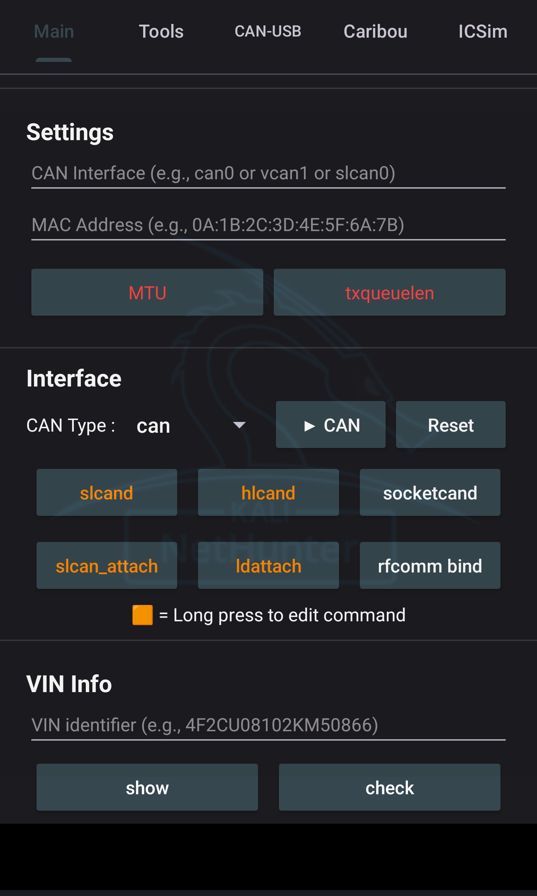


## Interface

Interface section is used to Configure your CAN interfaces. You may specify interface name in Settings, and optionally set a custom MTU and txqueuelen value.

You also may enable some Daemon/services described bellow.

> You can customize Orange button by long pressing it.


### slcand

Daemon for Serial CAN devices.

***slcand - Used command :***

```bash
slcand -s6 -t sw -S 200000 /dev/ttyUSB0
```

### hlcand

This command may be edited by a long press on the button. You may modify this as your wish.

This is a fork of slcand, specially made for ELM327 microcontroller.

***hlcand - Used command :***

```bash
hlcand -F -S 500000 /dev/ttyUSB0
```

### socketcand

Daemon to bridge CAN interfaces.

***socketcand - Settings Prerequisite :*** 

Set "CAN Inteface" in Settings.

***socketcand - Used command :***

```bash
socketcand -v -l wlan0 -i <CAN Interface>
```

### slcan_attach

Attach your serial CAN device.

***slcan_attach - Used command :***

```bash
slcan_attach -s6 -o /dev/ttyUSB0
```

### ldattach

Attach your device. Set as default for /dev/rfcomm0 (Bluetooth)

***ldattach - Used command :***

```bash
ldattach --debug --speed 38400 --eightbits --noparity --onestopbit --iflag -ICRNL,INLCR,-IXOFF 29 /dev/rfcomm0
```

### RFCOMM bind

For bluetooth CAN adapter usage. Run it to bind bluetooth to your device.

***Bind RFCOMM - Settings Prerequisite :*** 

Set "Target" MAC address in Settings.

> Note : RFCOMM should be supported, you need to enable services in bluetooth arsenal prior this to work.
> Pair and Trust your bluetooth device with bluetoothctl prior using this.

***Bind RFCOMM - Used command :***

```bash
rfcomm bind <selected interface> <Target MAC Address>
```

### CAN Interfaces


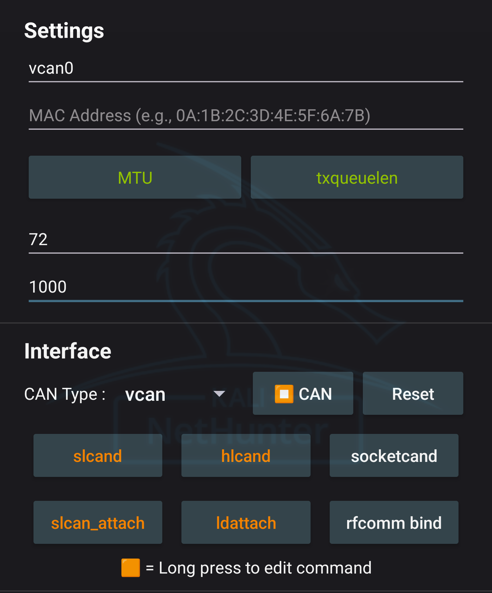


***Start CAN Interface - Settings Prerequisite :*** 

Set "CAN Interface", "CAN Type" in Inteface. And optionally enable 'MTU' and 'txqueulen to set custom value'. If 'VCAN' is selected as type, nothing more is needed.

> If you use adapter for CAN or SLCAN interfaces, you may need to setup "ldattach","slcand","slcan_attach","rfcomm bind" or "socketcand"

***Start CAN Interface - Used command :***


If CAN Type is set to VCAN it will first add it.

```bash
sudo ip link add dev <CAN Interface> type vcan
```

The following command is executed to start interface.

```bash
sudo ip link set <CAN Interface> up 
```

If you wish to use custom MTU and txqueulen, the following commands is executed respectively.

***MTU - Used command :***

```bash
sudo ip link set <CAN Inteface> MTU <MTU Value> 
```

***txqueuelen - Used command :***

```bash
sudo ip link set <CAN Inteface> txqueuelen <txqueuelen Value> 
```

***Stop CAN Interface - Settings Prerequisite :*** 

Set "CAN Interface" in Settings

***Stop CAN Interface - Used command :***

```bash
sudo ip link set <CAN Interface> down
```

Additionally if VCAN was used as interface type.

```bash
sudo ip link delete <CAN Interface>
```

***Reset Interface - Used command :***

It execute the <a href="https://raw.githubusercontent.com/V0lk3n/NetHunter-CarArsenal/refs/heads/main/can_reset.sh">following script</a> to reset interfaces.

### VIN Info

VIN Info is used to decode VIN identifier.

***Show command used :***

```bash
vininfo show <vinNumber>
```

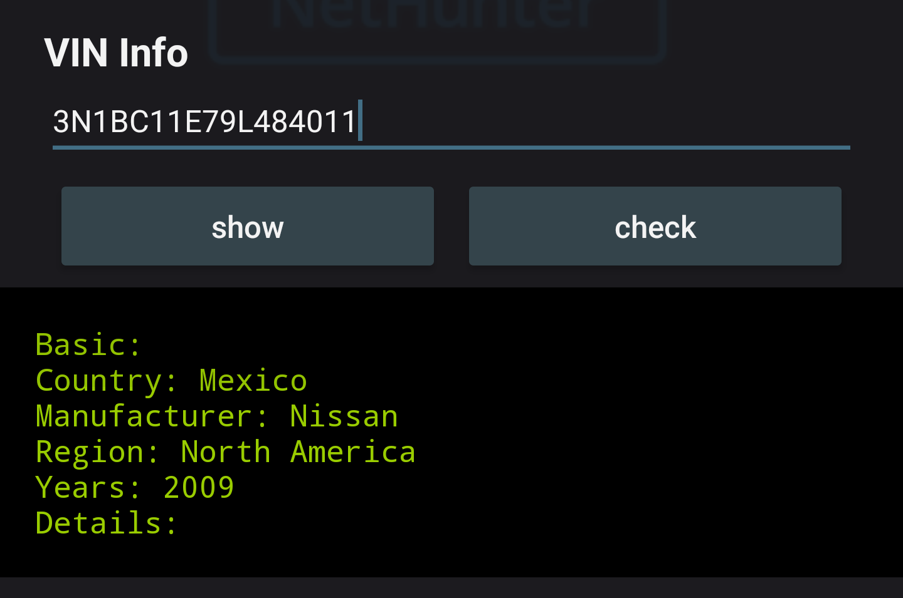

***Check command used :***

```bash
vininfo check <vinNumber>
```

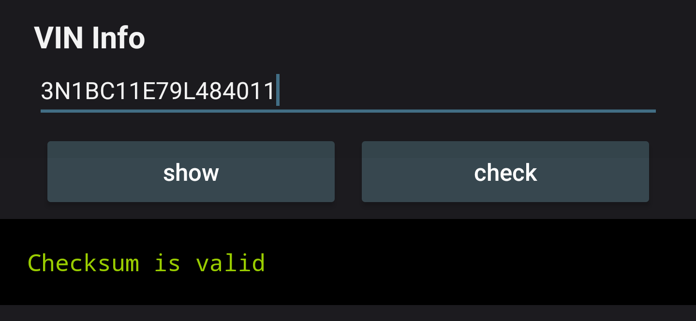


## Tools


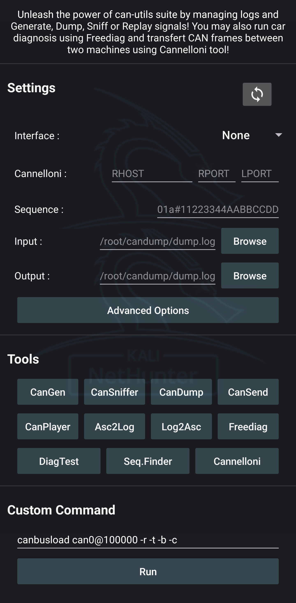


### Can-Utils : CanGen

Used to generate CAN Bus Traffic.


***CanGen - Settings Prerequisite :*** 

Your desired CAN Interface should be started and set in Settings.


***CanGen - Used command :***

```bash
cangen <CAN Interface> -v
```


### Can-Utils : CanSniffer

Used to sniff CAN Bus Traffic.


***CanSniffer - Settings Prerequisite :*** 

Your desired CAN Interface should be started and set in Settings.


***CanSniffer - Used command :***

```bash
cansniffer <CAN Interface>
```


### Can-Utils : CanDump

Used to dump CAN Bus traffic to an output file.


***CanDump - Settings Prerequisite :*** 

Your desired CAN Interface should be started and set with "Output" path in Settings. 


***CanDump - Used command :***

```bash
candump <CAN Inteface> -f <Output Log>
```


### Can-Utils : CanSend

Used to replay a specific sequence to CAN bus.


***CanSend - Settings Prerequisite :*** 

Your desired CAN Interface should be started and set with "Sequence" in Settings. 

***CanSend - Used command :***

```bash
cansend <CAN Interface> <Sequence>
```

### Can-Utils : CanPlayer

Used to replay dumped sequences from a log file to CAN bus.


***CanPlayer - Settings Prerequisite :*** 

Your desired CAN Interface should be started and set with "Input" path in Settings. 

> CAN Interface will be taken from the Input Log, check that your interface is the same one. (If you dump with vcan0, you should replay with vcan0)

***CanPlayer - Used command :***

```bash
canplayer -I <Input Log>
```

### Asc2Log

From can-utils suite, Asc2Log is used to convert ASC file format to the classic LOG.


***Asc2Log - Settings Prerequisite :*** 

Set "Input" and "Output" path in Settings. 


***Asc2Log - Used command :***

```bash
asc2log -I <Input Log> -O <Output File>
```


### Log2Asc

From can-utils suite, Log2Asc is used to convert dumped LOG file to the ASC format.


***Log2Asc - Settings Prerequisite :*** 

Your desired CAN Interface should be started and set with "Input", "Output" path in Settings. 


***Log2Asc - Used command :***

```bash
log2asc -I <Input Log> -O <Output File> <CAN Interface>
```


### Freediag

Used to diagnose your car.


***Freediag - Used command :***

```bash
sudo -u kali freediag
```


### Freediag : DiagTest

DiagTest is a standalone program from Freediag, used to exercise code paths.


***DiagTest - Used command :***

```bash
sudo -u kali diag_test
```

### Custom Script : SequenceFinder

<a href="https://raw.githubusercontent.com/V0lk3n/NetHunter-CarArsenal/refs/heads/main/sequence_finder.sh">You can see the source code here.</a>

Used to find the exact sequence of the desired action from a log file.

>This custom script will auto split a log files using head and tail. Replay theses with user input in loop using CanPlayer, until finding the exact sequence of the desired action. Finally it replay it using CanSend.


***SequenceFinder - Settings Prerequisite :*** 

Your desired CAN Interface should be started and set with "Input" path in Settings. 

> CAN Interface will be taken from the Input Log, check that your interface is the same one. (If you dump with vcan0, you should replay with vcan0)


***SequenceFinder - Used command :***

```bash
/opt/car_hacking/sequence_finder.sh <Input Log>
```

### Cannelloni

Used to communicate with two machine on a CAN bus by Ethernet.

***Cannelloni - Settings Prerequisite :*** 

Your desired CAN Interface should be set in Settings.

In Cannelloni, "RHOST", "RPORT" and "LPORT" need to be set.

> Both device should be linked using an Ethernet Cable.

***Cannelloni - Used command :***

```bash
sudo cannelloni -I <CAN Interface> -R <RHOST> -r <RPORT> -l <LPORT>
```

### Advanced Options

For CanGen and CanPlayer, you can enable/disable "verbose", "interactive mode" and "disable local loopback" arguments.

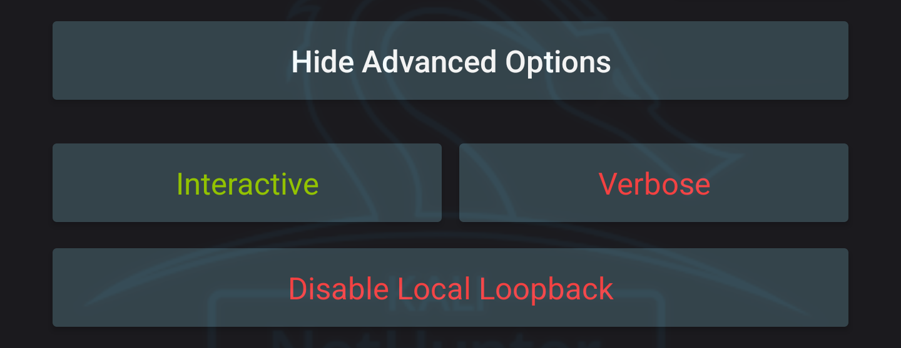


### Custom Command

Used in case you need to run a specific command which doesnt match the one provided.


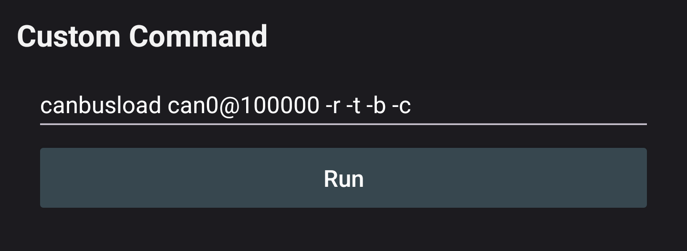


## CAN-USB

Mainly used for 'CAN USB Analyser' to Dump and Send sequence.


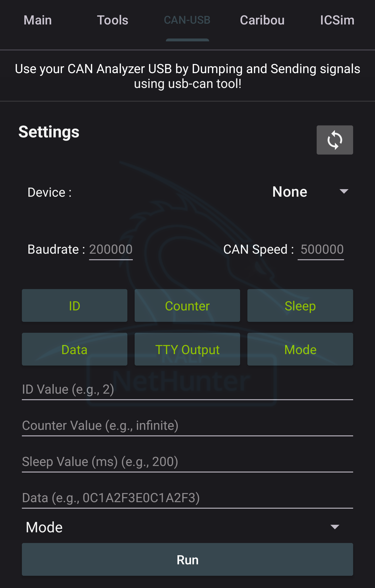


***CAN-USB - Settings Prerequisite :*** 

Set "USB Device", "CAN Speed" and "Baudrate". 

Then chose and set your advanced options.

> CAN USB Adapter should be plugged in your device and hit refresh button to set USB Device with you'r plugged adapter.


***CAN-USB - Used command :***

```bash
canusb -d <Selected USB> -s <CAN Speed> -b <Baudrate> debugEnabled + idValue + dataValue + sleepValue + countValue + modeValue
```

## Caribou

Caribou provide <a href="https://github.com/CaringCaribou/caringcaribou/blob/master/documentation/dump.md">Dump</a>, <a href="https://github.com/CaringCaribou/caringcaribou/blob/master/documentation/listener.md">Listener</a>, <a href="https://github.com/CaringCaribou/caringcaribou/blob/master/documentation/fuzzer.md">Fuzz</a>, <a href="https://github.com/CaringCaribou/caringcaribou/blob/master/documentation/send.md">Send</a>, <a href="https://github.com/CaringCaribou/caringcaribou/blob/master/documentation/uds.md">UDS</a> and <a href="https://github.com/CaringCaribou/caringcaribou/blob/master/documentation/xcp.md">XCP</a> modules.


Each module redirect to its documentation.

***Modules features***

* <a href="https://github.com/CaringCaribou/caringcaribou/blob/master/documentation/fuzzer.md">Fuzz module</a> : brute, identify, mutate, random, replay
* <a href="https://github.com/CaringCaribou/caringcaribou/blob/master/documentation/send.md">Send module</a> : file, message
* <a href="https://github.com/CaringCaribou/caringcaribou/blob/master/documentation/uds.md">UDS module</a> : discovery, services
* <a href="https://github.com/CaringCaribou/caringcaribou/blob/master/documentation/xcp.md">XCP module</a> : discovery, info, dump


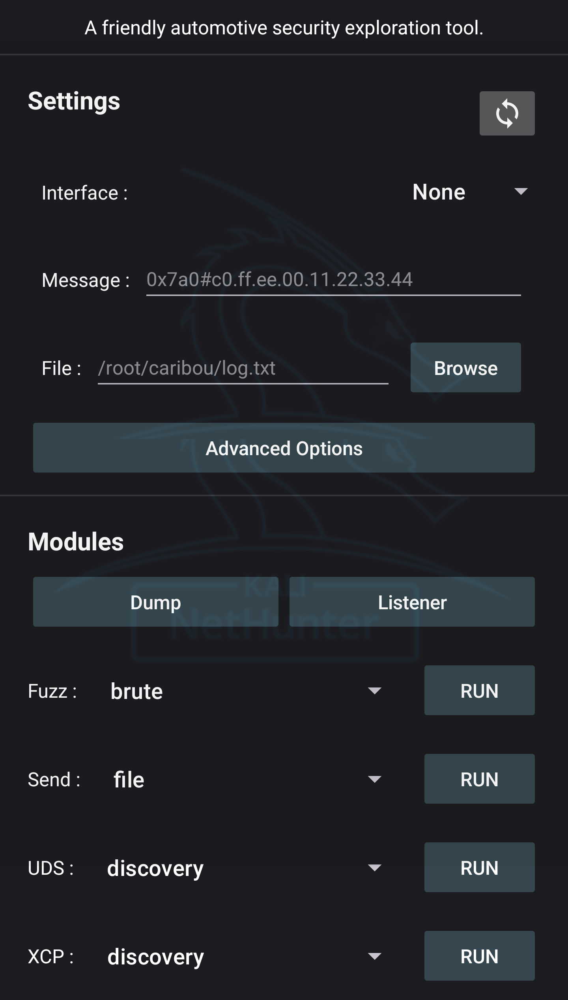


## ICSim

Here you can run ICSim from OpenGarage directly in Nethunter app using noVNC.

Mainly used to make a simulation of CARsenal using VCAN interface.


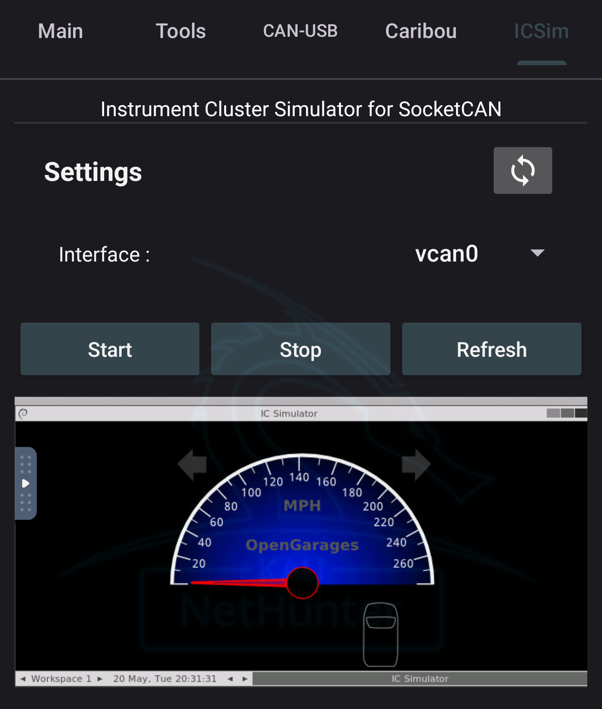


To start ICSim, it execute <a href="https://raw.githubusercontent.com/V0lk3n/NetHunter-CarArsenal/refs/heads/main/icsim_start.sh">the following script</a>.

To stop ICSim, it execute <a href="https://raw.githubusercontent.com/V0lk3n/NetHunter-CarArsenal/refs/heads/main/icsim_stop.sh">the following script</a>.

If the simulator is not showing, you may use Refresh button, to refresh the webview.

## Resources

***Tools Documentations***
* <a href="https://github.com/linux-can/can-utils">can-utils</a>
* <a href="https://freediag.sourceforge.io/">freediag</a>
* <a href="https://github.com/kobolt/usb-can">usb-can</a>
* <a href="https://github.com/mguentner/cannelloni">cannelloni</a>
* <a href="https://github.com/idlesign/vininfo">VIN Info</a>
* <a href="https://github.com/CaringCaribou/caringcaribou">CaringCaribou</a>
* <a href="https://github.com/zombieCraig/ICSim">ICSim</a>


***Guide***
* <a href="https://www.offsec.com/blog/introduction-to-car-hacking-the-can-bus/?utm_source=kali&utm_medium=web&utm_campaign=docs">Introduction to Car Hacking: The CAN Bus</a>


## Credits

* <a href="https://github.com/alexmohr">Alexmohr</a> for can-usb fork
* <a href="https://github.com/CaringCariboucaringcaribou">CaringCaribou</a> for its tool
* <a href="https://github.com/fenugrec">Fenugrec</a> for freediag
* <a href="https://github.com/idlesign/vininfo">idlesign</a> for VIN Info
* <a href="https://gitlab.com/kimoc0der">Kimocoder</a> for help and support
* <a href="https://github.com/kobolt">Kobolt</a> for usb-can
* <a href="https://github.com/linux-can">Linux-Can</a> for can-utils and socketcand
* <a href="https://github.com/mguentner">Mguentner</a> for cannelloni
* <a href="https://gitlab.com/V0lk3n">V0lk3n</a> for Nethunter CAN Arsenal tab
* <a href="https://gitlab.com/yesimxev">Yesimxev</a> for help and support
* <a href="https://github.com/zombieCraig">zombieCraig</a> for ICSim
