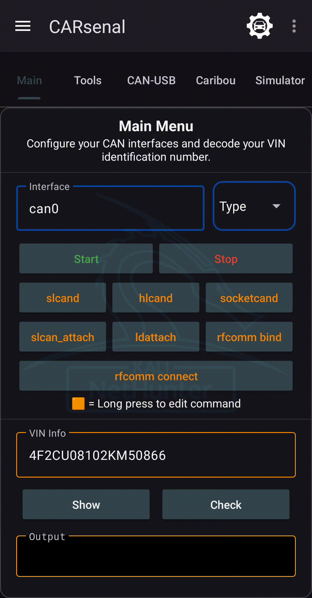
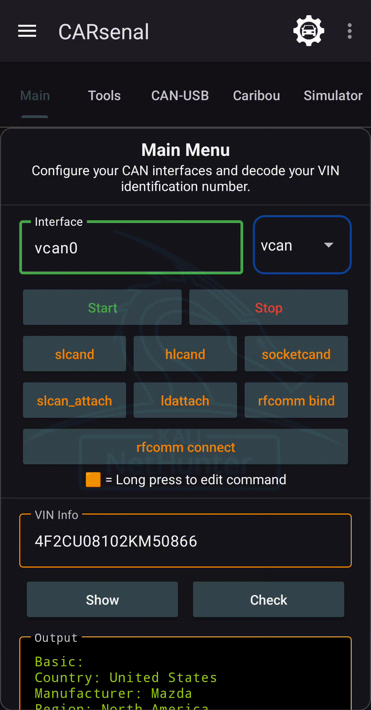
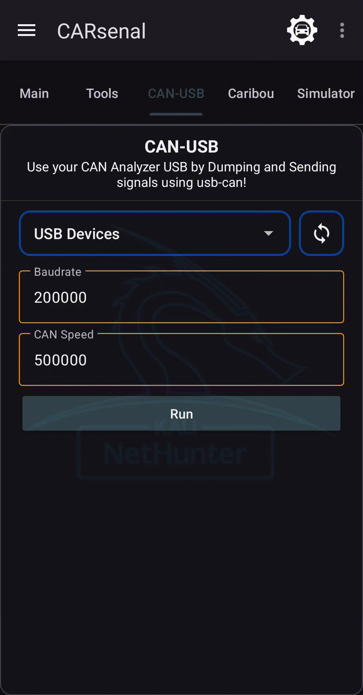
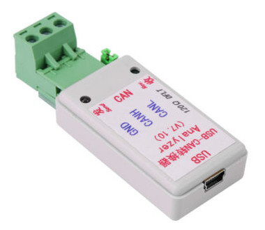
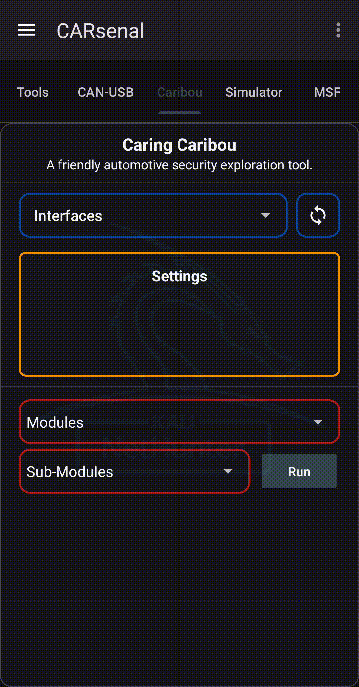

CARsenal is used to provide a Automotive Security toolset.

## Prerequisite - Kernel Modification

Your kernel should have CAN support enabled. For more informations, follow <a href="https://www.kali.org/docs/nethunter/nethunter-kernel-9-config-8/" target="_blank">"Configuring the Kernel - CARsenal"</a> documentation.


## CARsenal Documentations

- <a href="#main">Main</a> : Configure CAN interface and decode VIN identification.
- <a href="#tools">Tools</a> : Provide can-utils suite, cannelloni or Freediag.
- <a href="#can-usb">CAN-USB</a> : Use CAN Analyzer USB to dump and send signals.
- <a href="#caribou">Caribou</a> : Caring Caribou automotive security exploration tool.
- <a href="#simulator">Simulator</a> : ICSim and UDSim simulators.
- <a href="#msf">MSF</a> : Metasploit Automotive Modules.

## Resources

***Tools Documentations***
* <a href="https://github.com/linux-can/can-utils" target="_blank">can-utils</a>
* <a href="https://freediag.sourceforge.io/" target="_blank">freediag</a>
* <a href="https://github.com/kobolt/usb-can" target="_blank">usb-can</a>
* <a href="https://github.com/mguentner/cannelloni" target="_blank">cannelloni</a>
* <a href="https://github.com/idlesign/vininfo" target="_blank">VIN Info</a>
* <a href="https://github.com/CaringCaribou/caringcaribou" target="_blank">CaringCaribou</a>
* <a href="https://github.com/zombieCraig/ICSim" target="_blank">ICSim</a>
* <a href="https://github.com/zombieCraig/UDSim" target="_blank">UDSim</a>


***Guide***
* <a href="https://www.offsec.com/blog/introduction-to-car-hacking-the-can-bus" target="_blank">Introduction to Car Hacking: The CAN Bus</a>


## Credits

* <a href="https://github.com/alexmohr" target="_blank">Alexmohr</a> for can-usb fork
* <a href="https://github.com/CaringCariboucaringcaribou" target="_blank">CaringCaribou</a> for its tool
* <a href="https://github.com/fenugrec" target="_blank">Fenugrec</a> for freediag
* <a href="https://github.com/idlesign/vininfo" target="_blank">idlesign</a> for VIN Info
* <a href="https://gitlab.com/kimoc0der" target="_blank">Kimocoder</a> for help and support
* <a href="https://github.com/kobolt" target="_blank">Kobolt</a> for usb-can
* <a href="https://github.com/linux-can" target="_blank">Linux-Can</a> for can-utils and socketcand
* <a href="https://github.com/mguentner" target="_blank">Mguentner</a> for cannelloni
* <a href="https://gitlab.com/V0lk3n" target="_blank">V0lk3n</a> for Nethunter CARsenal tab
* <a href="https://gitlab.com/yesimxev" target="_blank">Yesimxev</a> for help and support
* <a href="https://github.com/zombieCraig" target="_blank">zombieCraig</a> for ICSim and UDSim
* <a href="https://www.rapid7.com/"> rapid7</a> for Metasploit Framework.
* <a href="https://www.crunchbase.com/person/craig-smith-12"> Craig Smith</a> for MSF Automotive Modules.
* <a href="https://x.com/pietro_biondi94"> Pietro Biondi</a> for MSF Automotive Modules.
* <a href="https://ph.linkedin.com/in/shipjayturla"> Jay Turla</a> for MSF Automotive Modules.
* <a href="https://x.com/johbraun"> Johannes Braun</a> for MSF Automotive Modules.
* <a href="https://de.linkedin.com/in/j%C3%BCrgen-d%C3%BCrrwang-75160217a"> Juergen Duerrwang</a> for MSF Automotive Modules.

<br>
<br>

- - - - - - - - - - - - - - - - - - - - - - - - - - - - - - - - - - - - - - - -

<br>
<br>


## Main

<p style="text-align: center"></p>

### Main : CAN Interfaces

***Start CAN Interface - Settings Prerequisite :***

Set "CAN Interface", "CAN Type" in Inteface. And optionally enable 'MTU' and 'txqueulen to set custom value'.

```bash
# For VCAN Type : create interface first
sudo ip link add dev <caniface> type vcan

# If MTU or txqueuelen value specified
sudo ip link set <caniface> mtu <Value>
sudo ip link set <caniface> txqueuelen <Value>

# Brought UP interface
sudo ip link set <caniface> up
```

***Reset Interface - Used command :***

It execute the <a href="https://raw.githubusercontent.com/V0lk3n/NetHunter-CarArsenal/refs/heads/main/can_reset.sh" target="_blank">following script</a> to reset interfaces.


### Main : Services

<p style="text-align: center"></p>

> You can customize services commands, by long pressing oranges buttons.

Interface section is used to Configure your CAN interfaces. You may specify interface name in Settings, and optionally set a custom MTU and txqueuelen value.

You also may enable some Daemon/services which are :

- slcand : Daemon for Serial CAN devices.
- hlcand : Fork of slcand made for ELM327 microcontroller.
- socketcand : Daemon to bridge CAN interfaces.
- slcan_attach : Attach your serial CAN device.
- ldattach : Attach your device.
- RFCOMM
    - bind : Bind bluetooth to your device.
    - connect : Connect the RFCOMM device to the remote Bluetooth device


### VIN Info

VIN Info is used to decode VIN identifier and check checksum.

```bash
vininfo show <vinNumber>
vininfo check <vinNumber>
```

<br>
<br>

- - - - - - - - - - - - - - - - - - - - - - - - - - - - - - - - - - - - - - - -

<br>
<br>


## Tools

<p style="text-align: center"></p>

> Commands are updated when configuring settings. You can long press on orange buttons to edit commands as well.

### Tools : Provided tools

- <a href="https://github.com/linux-can/can-utils" target="_blank">can-utils</a> : SocketCAN userspace utilities and tools.
    - <a href="https://manpages.debian.org/trixie/can-utils/cangen.1.en.html" target="_blank">cangen</a> : CAN frames generator for testing purposes.
    - <a href="https://manpages.debian.org/trixie/can-utils/cansniffer.1.en.html" target="_blank">cansniffer</a> : Volatile CAN content visualizer.
    - <a href="https://manpages.debian.org/trixie/can-utils/candump.1.en.html" target="_blank">candump</a> : Dump CAN bus traffic.
    - <a href="https://manpages.debian.org/trixie/can-utils/cansend.1.en.html" target="_blank">cansend</a> : Send CAN-frames via CAN_RAW sockets.
    - <a href="https://manpages.debian.org/trixie/can-utils/canplayer.1.en.html" target="_blank">canplayer</a> : Replay a compact CAN frame logfile to CAN devices.
    - <a href="https://manpages.debian.org/trixie/can-utils/asc2log.1.en.html" target="_blank">asc2log</a> : Convert ASC logfile to compact CAN frame logfile.
    - <a href="https://manpages.debian.org/trixie/can-utils/log2asc.1.en.html" target="_blank">log2asc</a> : Convert compact CAN frame logfile to ASC logfile.

- <a href="https://github.com/fenugrec/freediag" target="_blank">freediag</a> : Access your car diagnostic system.
    - <a href="https://github.com/fenugrec/freediag" target="_blank">diagtest</a> : Standalone program from Freediag, used to exercise code paths.

- <a href="https://github.com/mguentner/cannelloni" target="_blank">cannelloni</a> : Uses UDP, TCP or SCTP to transfer CAN frames between two machines.

- <a href="https://raw.githubusercontent.com/V0lk3n/NetHunter-CarArsenal/refs/heads/main/sequence_finder.sh">sequence_finder</a> : Custom script that split a log files, replay theses with CanPlayer until finding the exact sequence of the desired action. Finally it replay it using CanSend.

<br>
<br>

- - - - - - - - - - - - - - - - - - - - - - - - - - - - - - - - - - - - - - - -

<br>
<br>


## CAN-USB

<p style="text-align: center"></p>

> Command is updated when configuring settings.

CAN-USB is using the low cost hardware displayed bellow.



<br>
<br>

- - - - - - - - - - - - - - - - - - - - - - - - - - - - - - - - - - - - - - - -

<br>
<br>


## Caribou

<p style="text-align: center"></p>

> Selecting a Module and it's sub-module will display it's parameters in settings field.

### Modules and Sub-Modules

- <a href="https://github.com/CaringCaribou/caringcaribou/blob/master/documentation/dump.md" target="_blank">Dump</a>
- <a href="https://github.com/CaringCaribou/caringcaribou/blob/master/documentation/fuzzer.md" target="_blank">Fuzzer</a>
	- brute
	- identify
	- mutate
	- random
	- replay
- <a href="https://github.com/CaringCaribou/caringcaribou/blob/master/documentation/listener.md" target="_blank">Listener</a>
- module_template
- <a href="https://github.com/CaringCaribou/caringcaribou/blob/master/documentation/send.md" target="_blank">Send</a>
	- file
	- message
- <a href="https://github.com/CaringCaribou/caringcaribou/blob/master/documentation/uds.md" target="_blank">UDS</a>
    - discovery
    - services
    - subservices
    - ecu_reset
    - testerpresent
    - security_seed
    - dump_dids
    - read_mem
    - auto
- <a href="https://github.com/CaringCaribou/caringcaribou/blob/master/documentation/uds_fuzz.md" target="_blank">UDS_Fuzz</a>
    - delay_fuzzer
    - seed_randomness_fuzzer
- <a href="https://github.com/CaringCaribou/caringcaribou/blob/master/documentation/xcp.md" target="_blank">XCP</a>
	- discovery
	- info
	- commands
	- dump

<br>
<br>

- - - - - - - - - - - - - - - - - - - - - - - - - - - - - - - - - - - - - - - - 

<br>
<br>


## Simulator

<p style="text-align: center"></p>

> Once simulator is running. You can make ICSim/UDSim floatable for a better control. You may also Enable/Disable Controls WebView.

### How it work?

While starting simulator we use display 3 to 5 to avoid issue if kex or something else is running.

- Display 3 : ICSim
- Display 4 : Controls
- Display 5 : UDSim

Then it start a virtual framebuffer (Xvfb) on each display, run fluxbox as window manager and start x11vnc as VNC Server.

Once done, it run the simulator in each VNC display and start noVNC to have access to it in the browser.

Finally, Nethunter App will load the webview of noVNC to provide display.


### ICSim

ICSim documentation can be <a href="https://github.com/zombieCraig/ICSim" target="_blank">found here</a>.

ICSim is started/stopped through <a href="https://raw.githubusercontent.com/V0lk3n/NetHunter-CARsenal/refs/heads/main/icsim_service.sh"> the following script</a>.

### UDSim

UDSim documentation can be <a href="https://github.com/zombieCraig/UDSim" target="_blank">found here</a>.

UDSim is started/stopped through <a href="https://raw.githubusercontent.com/V0lk3n/NetHunter-CARsenal/refs/heads/main/udsim_service.sh"> the following script</a>.

<br>
<br>

- - - - - - - - - - - - - - - - - - - - - - - - - - - - - - - - - - - - - - - -

<br>
<br>


## MSF

<p style="text-align: center"></p>

### How to?

First you need to press on 'start msfconsole', it use screen to dettach and reattach msf session to be able to run the module in the same instance. 

Once msf is started, select your module and use "Info" to read module information, "Set" to configure module, and finally "Run" to execute it.

> Note : Actually, we can't automatically close the terminal window, so keep in mind that previous terminal window will still be opened but killed.

### Hardware Tools : ELM327 Relay 

- <a href="https://raw.githubusercontent.com/rapid7/metasploit-framework/refs/heads/master/tools/hardware/elm327_relay.rb" target="_blank">elm327_relay</a> : This module requires a connected ELM327 or STN1100 is connected to the machines serial. Sets up a basic RESTful web server to communicate

### Auxiliary Modules

- <a href="https://www.rapid7.com/db/modules/auxiliary/server/local_hwbridge/" target="_blank">local_hwbridge</a> : Sets up a web server to bridge communications between Metasploit and physically attached hardware.
- <a href="https://www.rapid7.com/db/modules/auxiliary/client/hwbridge/connect/" target="_blank">connect</a> : Connect the physical HWBridge which  
will start an interactive hwbridge session (local_hwbridge should be running).

### Post Modules
- <a href="https://www.rapid7.com/db/modules/post/hardware/automotive/can_flood/" target="_blank">can_flood</a> : Floods a CAN interface with supplied frames.
- <a href="https://www.rapid7.com/db/modules/post/hardware/automotive/canprobe/" target="_blank">canprobe</a> : Scans between two CAN IDs and writes data at each byte position.
- <a href="https://www.rapid7.com/db/modules/post/hardware/automotive/diagnostic_state/" target="_blank">diagnostic_state</a> : Keep the vehicle in a diagnostic state on rounds by sending tester present packet.
- <a href="https://www.rapid7.com/db/modules/post/hardware/automotive/ecu_hard_reset/" target="_blank">ecu_hard_reset</a> : Performs hard reset in the ECU Reset Service Identifier (0x11).
- <a href="https://www.rapid7.com/db/modules/post/hardware/automotive/getvinfo/" target="_blank">getvinfo</a> : This module queries DTCs, some common engine info, and vehicle information.
- <a href="https://www.rapid7.com/db/modules/post/hardware/automotive/identifymodules/" target="_blank">identifymodules</a> : Scan the CAN bus for any modules that can respond to UDS DSC queries.
- <a href="https://www.rapid7.com/db/modules/post/hardware/automotive/malibu_overheat/" target="_blank">malibu_overheat</a> : Simple sample temp flood for the 2006 Malibu.
- <a href="https://www.rapid7.com/db/modules/post/hardware/automotive/mazda_ic_mover/" target="_blank">mazda_ic_mover</a> : Moves the needle of the accelorometer and speedometer of the Mazda 2 instrument cluster.
- <a href="https://www.rapid7.com/db/modules/post/hardware/automotive/pdt/" target="_blank">pdt</a> : Acting in the role of a Pyrotechnical Device Deployment Tool (PDT)
