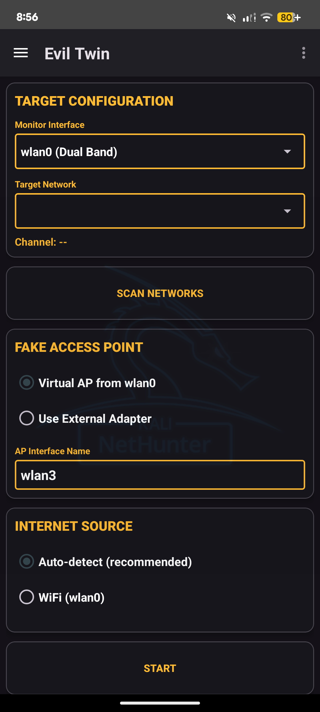
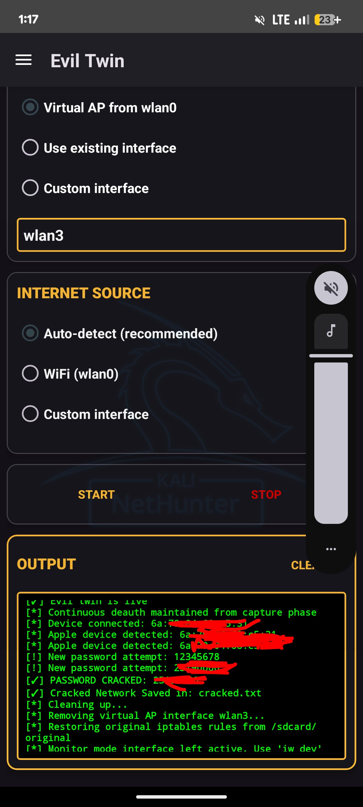

The [EvilTwin](https://github.com/dr1408/eviltwin) attack module captures the handshake of the target network and creates a rogue access point with a captive portal to phish for passwords using handshake verification.

You can run a fake Access Point with a captive portal that mimics the target network. Customise the settings such as the target SSID, and monitor interface name. The module supports both virtual AP creation from wlan0 or using a second external adapter to broadcast the fake ap . Internet sharing is auto-detected or can be manually specified.

*Figure 1: Evil Twin module main interface*

Once configured, tap the **Start** button to begin the attack. The module will:
1. **Capture handshake** - Deauthenticate clients and capture WPA handshake
2. **Start AP** - Create a fake AP with the target SSID
3. **Serve portal** - Display a captive portal to capture credentials
4. **Monitor attack** - Log connections and password attempts in real-time

*Figure 2: Evil Twin attack running with log output*

### Features

- WiFi network scanning
- Client detection with a 30-second timeout
- WPA handshake capture with deauthentication attack
- Virtual AP creation or external adapter support
- Password capture through captive portal
- Handshake saved for offline cracking
- Real-time attack logging in UI
- Supports 2.4 GHz and 5 GHz networks

### Requirements

- External WiFi adapter with monitor mode support
- Root access

### Credits

- [yesimxev](https://gitlab.com/yesimxev) - module improvements and help
- [Justxd22](https://github.com/Justxd22) - Handshake verification method