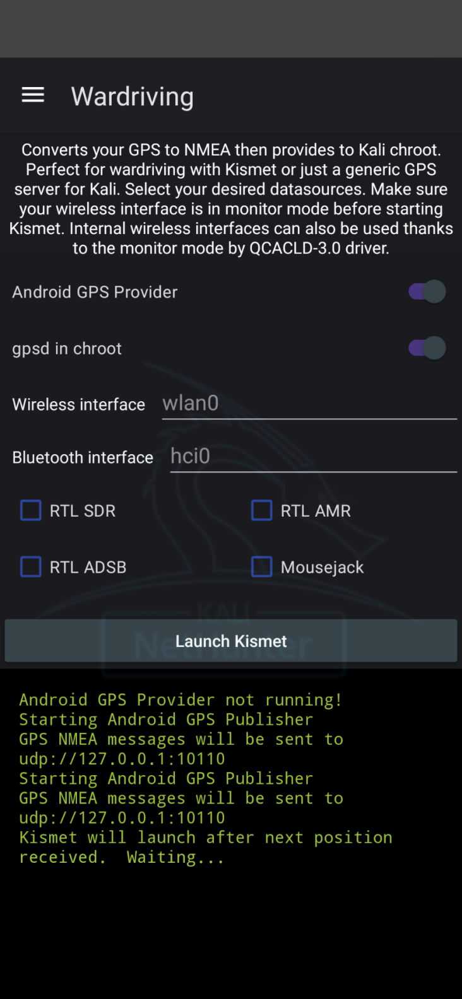

# Wardriving

NetHunter’s Wardriving panel merges your Android device’s GPS and external radios into Kismet, producing a real-time, geotagged RF heatmap. Use its toggles to feed Kismet live location and capture streams from Wi-Fi, Bluetooth, RTL-SDR and vulnerability scanners.

## Options

### GPS

- **Android GPS Provider**
  Starts the Android GPS Publisher service on UDP port 10110, streaming NMEA sentences to Kismet.

- **gpsd in chroot**
  Runs `gpsd` inside the Kali chroot (TCP 2947) and enables Kismet’s `--use-gpsd-gps` support.

### Kismet

#### Interfaces

- **Wireless interface**
  The Wi-Fi device that must already be in monitor-mode (e.g. `wlan0`).
  *Enable monitor mode via `airmon-ng start wlan0` or Custom Commands ▶ Start wlan0 in Monitor Mode.*

- **Bluetooth interface**
  The HCI device for BLE/classic sniffing (e.g. `hci0`).

#### Additional options

- **RTL SDR**
  Activates the generic RTL-SDR plugin for broad-spectrum scanning.

- **RTL AMR**
  Decodes Automatic Meter Reading telemetry from utility meters.

- **RTL ADSB**
  Decodes ADS-B aircraft broadcasts.

#### Attacks

- **Mousejack**
  Captures unencrypted HID frames from vulnerable 2.4 GHz mice and keyboards.

## Workflow

1. **(Optional, if GPS desired)** Enable **Android GPS Provider**  then enable **gpsd in chroot** (`--use-gpsd-gps`)
2. Put your Wi-Fi radio into monitor mode and set **Wireless interface**
3. **Optional**: Select **Bluetooth interface**
4. **Optional**: Enable RTL-SDR options: broad spectrum, AMR or ADSB
5. **Optional**: Enable **Mousejack** attack
6. Tap **Launch Kismet** and to start `kismet_server` with all selected sources. Wardriving app will wait for the first GPS fix and successful Kismet launch before opening the browser UI.

## Logging

Status and debug messages appear in the **logging area** at the bottom of the panel.

