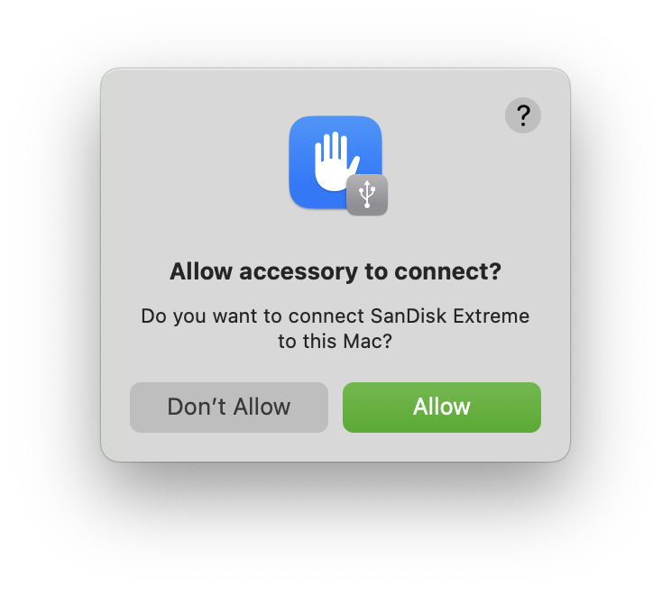
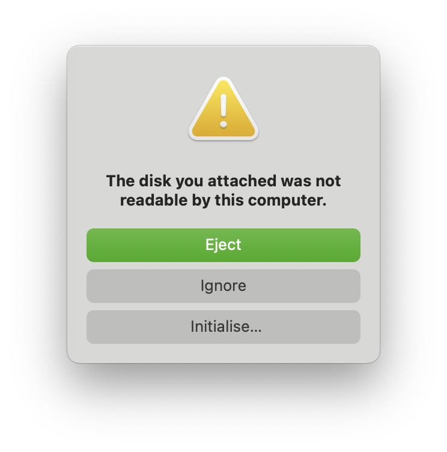
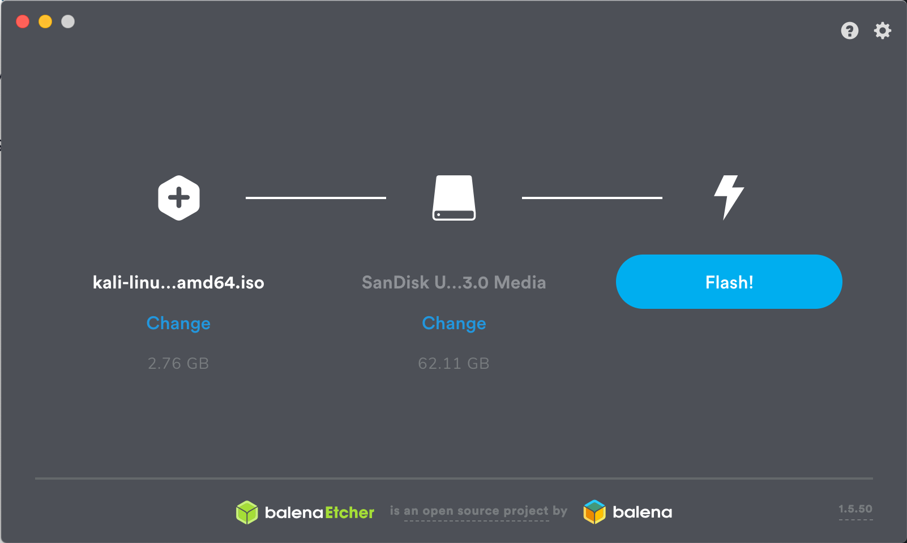

Our favorite way, and the fastest method, for getting up and running with Kali Linux is to run it "live" from a USB drive. This method has several advantages:

- It's non-destructive - it makes no changes to the host system's hard drive or installed OS, and to go back to normal operations, you simply remove the "Kali Live" USB drive and restart the system.
- It's portable - you can carry Kali Linux in your pocket and have it running in minutes on an available system
- It's customizable - you can [roll your own custom Kali Linux ISO image](/docs/development/live-build-a-custom-kali-iso/) and put it onto a USB drive using the same procedures
- It's potentially persistent - with a bit of extra effort, you can configure your Kali Linux "live" USB drive to have [persistent storage](/docs/usb/usb-persistence/), so the data you collect is saved across reboots

In order to do this, we first need to create a bootable USB drive which has been set up from an ISO image of Kali Linux.

### What You'll Need

1. A _verified_ copy of the appropriate ISO image of the latest Kali build image for the system you'll be running it on.
  - See the details on [downloading official Kali Linux images](/docs/introduction/download-official-kali-linux-images/).
2. As you're running under macOS/OS X, you can use the `dd` command, which should be pre-installed, or use [Etcher](https://www.balena.io/etcher/).
3. A USB thumb drive, 4GB or larger.
  - Systems with a direct SD card slot can use an SD card with similar capacity. The procedure is identical.

### Kali Linux Live USB Install Procedure

The specifics of this procedure will vary depending on whether you're doing it on a [Windows](/docs/usb/live-usb-install-with-windows/), [Linux](/docs/usb/live-usb-install-with-linux/), or [macOS/OS X](/docs/usb/live-usb-install-with-mac/) system.

- - -

## Creating a Bootable Kali USB Drive on macOS/OS X (DD)

macOS/OS X is based on UNIX, so creating a bootable Kali Linux USB drive in an macOS/OS X environment is similar to doing it on Linux.
Once you've [downloaded and verified your Kali ISO files](/docs/introduction/download-official-kali-linux-images/), you use `dd` to copy it over to your USB drive.

If you would prefer to use [Etcher](#creating-a-bootable-kali-usb-drive-on-macosos-x-etcher), then follow the same directions as a Windows user. Note that the USB drive will have a path similar to /dev/disk2.

{}
WARNING: You can easily overwrite a disk drive you didn't intend to with `dd` if you do not understand what you are doing, or if you specify an incorrect output path. Double-check what you're doing before you do it, it'll be too late afterwards.<br />
<br />
**Consider yourself warned**.
{}

1. **_Without_** the USB drive plugged into the system, open a Terminal window, and type the command `diskutil list` at the command prompt.
You will get a list of the device paths (looking like **/dev/disk0**, **/dev/disk1**, etc.) of the disks mounted on your system, along with information on the partitions on each of the disks.

```console
user@mbp ~ % diskutil list
/dev/disk0 (internal, physical):
   #:                       TYPE NAME                    SIZE       IDENTIFIER
   0:      GUID_partition_scheme                        *1.0 TB     disk0
   1:             Apple_APFS_ISC Container disk1         524.3 MB   disk0s1
   2:                 Apple_APFS Container disk3         994.7 GB   disk0s2
   3:        Apple_APFS_Recovery Container disk2         5.4 GB     disk0s3

/dev/disk3 (synthesized):
   #:                       TYPE NAME                    SIZE       IDENTIFIER
   0:      APFS Container Scheme -                      +994.7 GB   disk3
                                 Physical Store disk0s2
   1:                APFS Volume macOS - Data            547.8 GB   disk3s1
   2:                APFS Volume macOS                   11.2 GB    disk3s3
   3:              APFS Snapshot com.apple.os.update-... 11.2 GB    disk3s3s1
   4:                APFS Volume Preboot                 7.2 GB     disk3s4
   5:                APFS Volume Recovery                1.0 GB     disk3s5
   6:                APFS Volume VM                      3.2 GB     disk3s6

user@mbp ~ %
```
- - -

2. Plug your USB drive into your Apple computer's USB port.
Depending on the version of macOS/OS X as well as what was previously on the USB, you may get a series of prompts.

Go ahead and press "Allow" (as long as you trust the device!):



The data previously on the USB, macOS/OS X is unable to automatically mount it.
We already have a backup of the data, so we are not worried, so we are just going to "Ignore":



- - -

3. Now run the same command, "`diskutil list`" a second time. The output will look something (again, _not exactly_) like this, showing an additional device which wasn't there previously. Your USB drive's path will most likely be the last one. In any case, it will be one which wasn't present before.
For our example, you can see that there is now a **/dev/disk4** which wasn't previously present, a 64GB USB drive:

```console
user@mbp ~ % diskutil list
/dev/disk0 (internal, physical):
   #:                       TYPE NAME                    SIZE       IDENTIFIER
   0:      GUID_partition_scheme                        *1.0 TB     disk0
   1:             Apple_APFS_ISC Container disk1         524.3 MB   disk0s1
   2:                 Apple_APFS Container disk3         994.7 GB   disk0s2
   3:        Apple_APFS_Recovery Container disk2         5.4 GB     disk0s3

/dev/disk3 (synthesized):
   #:                       TYPE NAME                    SIZE       IDENTIFIER
   0:      APFS Container Scheme -                      +994.7 GB   disk3
                                 Physical Store disk0s2
   1:                APFS Volume macOS - Data            547.9 GB   disk3s1
   2:                APFS Volume macOS                   11.2 GB    disk3s3
   3:              APFS Snapshot com.apple.os.update-... 11.2 GB    disk3s3s1
   4:                APFS Volume Preboot                 7.2 GB     disk3s4
   5:                APFS Volume Recovery                1.0 GB     disk3s5
   6:                APFS Volume VM                      3.2 GB     disk3s6

/dev/disk4 (external, physical):
   #:                       TYPE NAME                    SIZE       IDENTIFIER
   0:      GUID_partition_scheme                        *62.7 GB    disk4
   1:       Microsoft Basic Data                         62.7 GB    disk4s1

user@mbp ~ %
```

- - -

4. Unmount the drive (assuming, for this example, the USB drive is **/dev/disk4** - _do **not** simply copy this, verify the correct path on your own system!_):

```console
user@mbp ~ % diskutil unmountDisk /dev/disk4
Unmount of all volumes on disk4 was successful
user@mbp ~ %
```

- - -

5. Proceed to (carefully!) image the Kali ISO file on the USB device. We will be assuming that the ISO image you're writing is named "kali-linux-2025.3-live-amd64.iso" and is in your current working directory.

```console
user@mbp ~ % file kali-linux-2025.3-live-amd64.iso
kali-linux-2025.3-live-amd64.iso: ISO 9660 CD-ROM filesystem data (DOS/MBR boot sector) 'Kali Linux amd64' (bootable)
user@mbp ~ %
```

DD's blocksize parameter can be increased, and while it may speed up the operation of the dd command, it can occasionally produce unbootable USB drives, depending on your system and a lot of different factors. The recommended value, "bs=4M", is conservative and reliable.

<!--
Additionally, the parameter "conv=fsync" makes sure that the data is physically written to the USB drives before the commands returns.
-->

{}
While '`/dev/diskX`' is used in the command, the '`/dev/diskX`' should be replaced with the drive discovered previously.<!-- '/dev/diskX' will not overwrite any devices, and can safely be used in documentation to prevent accidental overwrites.--><br />
<br />
**Please use the correct device name from the previous step**.
{}

We will replace "/dev/diskX" with "/dev/**r**diskX" _(extra `r`)_ **to improve the write speeds**.
<!--
```console
user@mbp ~ % time sudo dd if=Downloads/kali-linux-2025.3-installer-netinst-amd64.iso of=/dev/rdisk4 bs=4M status=progress
Password:
  654311424 bytes (654 MB, 624 MiB) transferred 5.032s, 130 MB/s
161+1 records in
161+1 records out
677380096 bytes transferred in 5.245105 secs (129145193 bytes/sec)
sudo dd if=Downloads/kali-linux-2025.3-installer-netinst-amd64.iso  bs=4M   0.01s user 0.22s system 2% cpu 7.902 total
user@mbp ~ %
user@mbp ~ % time sudo dd if=Downloads/kali-linux-2025.3-installer-netinst-amd64.iso of=/dev/disk4 bs=4M status=progress
  675282944 bytes (675 MB, 644 MiB) transferred 53.047s, 13 MB/s
161+1 records in
161+1 records out
677380096 bytes transferred in 53.276447 secs (12714438 bytes/sec)
sudo dd if=Downloads/kali-linux-2025.3-installer-netinst-amd64.iso  bs=4M   0.01s user 2.08s system 3% cpu 53.321 total
user@mbp ~ %
```
-->

```console
$ sudo dd if=kali-linux-2025.3-live-amd64.iso of=/dev/rdiskX bs=4M status=progress
```

{}
There is a chance you may receive an error when running the above command: `dd: invalid number: '4M'` <!-- ??? --> or `dd: bs: illegal numeric value`<!-- macOS "Big Sur" 11.7.10 -->.<br />
If this is the case, please change the `4M` to be `4m`.<br />
Additionally, increasing the blocksize (bs) will speed up the write progress, but will also increase the chances of creating a bad USB drive. Using the given value on macOS/OS X has produced reliable images consistently.<br />
<br />
Another potential error will be that `status=progress` does not work on your version of macOS. If this is the case, remove this section and instead use `CTRL+T` to measure status.
{}

Imaging the USB drive can take a good amount of time, over half an hour is not unusual, as the sample output below shows. Be patient!

The dd command will only provide feedback as it writes if `status=progress` is used, otherwise will only show when it's completed, but if your drive has an access indicator, you'll probably see it flickering from time to time. The time to `dd` the image across will depend on the speed of the system used, USB drive itself, and USB port it's inserted into. Once dd has finished imaging the drive, it will output something that looks like this:

```plaintext
893+1 records in
893+1 records out
3748147200 bytes transferred in 915.043994 secs (4096139 bytes/sec)
```

After DD completes, macOS/OS X may try to remount the USB device again. If so, you will get the same pop-up as before.


We suggest the default option this time, "Eject".

- - -

And that's it!

## Creating a Bootable Kali USB Drive on macOS/OS X (Etcher)

If you would like a graphical option to flash, we recommend [Etcher](https://www.balena.io/etcher/)

1. Download and run Etcher.
2. Choose the Kali Linux ISO file to be imaged with "select image" and verify that the USB drive to be overwritten is the correct one. Click the "Flash!" button once ready.

3. Once Etcher alerts you that the image has been flashed, you can safely remove the USB drive.

You can now boot into a Kali Live / Installer environment using the USB device.

## Booting USB on Apple

To boot from an alternate drive on an macOS/OS X system, bring up the boot menu by pressing the **Option** key immediately after powering on the device and select the drive you want to use.

For more information, see [Apple's knowledge base](https://support.apple.com/kb/ht1310).
