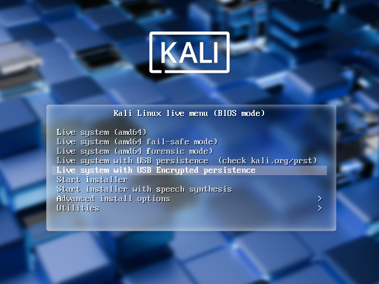

<!--
This was previous a Kali Dojo workshop

In this workshop, we will examine the various features available to us when booting Kali Linux from USB devices. We will explore features such as persistence, creating LUKS encrypted persistence stores, and even dabble in "LUKS Nuking" our USB drive. The default Kali Linux ISOs (from 1.0.7 onwards) support USB encrypted persistence.
-->

Kali Linux "Live" has two options in the default boot menu which enable persistence - the preservation of data on the "Kali Live" USB drive - across reboots of "Kali Live". You can either do:

- [USB Persistence](/docs/usb/usb-persistence/)
- [USB Encrypted Persistence](/docs/usb/usb-persistence-encryption/) (This guide)

This can be an extremely useful enhancement, and enables you to retain documents, collected testing results, configurations, etc., when running Kali Linux "Live" from the USB drive, even across different systems. The persistent data is stored in its own partition on the USB drive, which will be LUKS-encrypted.

To make use of the USB persistence options at boot time, you'll need to do some additional setup on your "Kali Linux Live" USB drive; this article will show you how.

This guide assumes that you have already created a Kali Linux "Live" USB drive as described in [the doc page for that subject](/docs/usb/live-usb-install-with-windows/). For the purposes of this article, we'll assume you're working on a Linux-based system.

{}
You'll need to have root privileges to do this procedure, or the ability to escalate your privileges with `sudo`.
{}

- - -

{}
While '/dev/sdX' is used through this page, the '/dev/sdX' should be replaced with the proper device label. '/dev/sdX' will not overwrite any devices, and can safely be used in documentation to prevent accidental overwrites. Please use the correct device label.
{}

- - -

**0x01 - Start by imaging the Kali ISO onto your USB drive**.

Ours was /dev/sdX:

```console
kali@kali:~$ sudo dd if=kali-linux-2025.1-live-amd64.iso of=/dev/sdX conv=fsync bs=4M
```

Once done, you can inspect the USB partition structure using `parted /dev/sdX print`:

```console
kali@kali:~$ sudo parted /dev/sdX print
Model: SanDisk Extreme (scsi)
Disk /dev/sdX: 62.7GB
Sector size (logical/physical): 512B/512B
Partition Table: msdos
Disk Flags:

Number  Start   End     Size    Type     File system  Flags
 1      32.8kB  4927MB  4927MB  primary               boot, hidden
 2      4927MB  4932MB  4194kB  primary

kali@kali:~$
```

- - -

**0x02 - Create and format an additional partition on the USB drive**.

In our example, we create a persistent partition in the empty space above the Kali Live partitions:

```console
kali@kali:~$ sudo fdisk /dev/sdX <<< $(printf "p\nn\np\n\n\n\np\nw")
```

When fdisk completes, the new partition should have been created at `/dev/sdX3`; this can be verified with the command `lsblk /dev/sdX`:

```console
kali@kali:~$ lsblk /dev/sdX
NAME   MAJ:MIN RM  SIZE RO TYPE MOUNTPOINTS
sdc      8:32   1 58.4G  0 disk
├─sdc1   8:33   1  4.6G  0 part
├─sdc2   8:34   1    4M  0 part
└─sdc3   8:35   1 53.8G  0 part
kali@kali:~$
```

- - -

**0x03 - Encrypt the partition with LUKS**.

```console
kali@kali:~$ sudo cryptsetup --verbose --verify-passphrase luksFormat /dev/sdX3
WARNING!
========
This will overwrite data on /dev/sdX3 irrevocably.

Are you sure? (Type 'yes' in capital letters): YES
Enter passphrase for /dev/sdX3:
Verify passphrase:
Existing 'ext4' superblock signature on device /dev/sdX3 will be wiped.
Key slot 0 created.
Command successful.
kali@kali:~$
```

- - -

**0x04 - Open the encrypted partition**.

```console
kali@kali:~$ sudo cryptsetup luksOpen /dev/sdX3 my_usb
Enter passphrase for /dev/sdX3:
kali@kali:~$
```

- - -

**0x05 - Create an ext4 filesystem and label it**.

```console
kali@kali:~$ sudo mkfs.ext4 -L persistence /dev/mapper/my_usb
mke2fs 1.47.2 (1-Jan-2025)
Creating filesystem with 14110720 4k blocks and 3530752 inodes
Filesystem UUID: aca1783a-4665-4077-b555-c748e391def1
Superblock backups stored on blocks:
	32768, 98304, 163840, 229376, 294912, 819200, 884736, 1605632, 2654208,
	4096000, 7962624, 11239424

Allocating group tables: done
Writing inode tables: done
Creating journal (65536 blocks): done
Writing superblocks and filesystem accounting information: done

kali@kali:~$
```

<!--
```console
kali@kali:~$ sudo e2label /dev/mapper/my_usb persistence
kali@kali:~$
```
-->

- - -

**0x06 - Mount the partition and create your persistence.conf so changes persist across reboots**.

```console
kali@kali:~$ sudo mkdir -pv /mnt/my_usb
mkdir: created directory '/mnt/my_usb'
kali@kali:~$
kali@kali:~$ sudo mount -v /dev/mapper/my_usb /mnt/my_usb
mount: /dev/mapper/my_usb mounted on /mnt/my_usb.
kali@kali:~$
kali@kali:~$ echo "/ union" | sudo tee /mnt/my_usb/persistence.conf
/ union
kali@kali:~$
kali@kali:~$ sudo umount -v /mnt/my_usb
umount: /mnt/my_usb unmounted
kali@kali:~$
```

- - -

**0x07 - Close the encrypted partition**.

```console
kali@kali:~$ sudo cryptsetup luksClose /dev/mapper/my_usb
kali@kali:~$
```

Now your USB drive is ready to plug in and reboot into Live USB Encrypted Persistence mode.

```console
kali@kali:~$ reboot
```



## Emergency Self Destruction of Data in Kali

<!-- Kali Boot Nuke -->

As penetration testers, we often need to travel with sensitive data stored on our laptops. Of course, we use full disk encryption (FDE) wherever possible, including our Kali Linux machines, which tend to contain the most sensitive materials. Let's configure a [nuke password](/blog/nuke-kali-linux-luks/) as a safety measure:

```console
kali@kali:~$ sudo apt install -y cryptsetup-nuke-password
[...]
kali@kali:~$
kali@kali:~$ sudo dpkg-reconfigure cryptsetup-nuke-password
INFO: Storing the nuke password's crypted hash in /etc/cryptsetup-nuke-password/password_hash
Processing triggers for initramfs-tools (0.145) ...
update-initramfs: Generating /boot/initrd.img-6.11.2-amd64
kali@kali:~$
```

The configured nuke password will be stored in the initrd and will be usable with all encrypted partitions that you can unlock at boot time.

- - -

**Backup you LUKS keyslots and encrypt them**

```console
kali@kali:~$ sudo cryptsetup luksHeaderBackup --header-backup-file luksheader.back /dev/sdX3
kali@kali:~$
kali@kali:~$ sudo openssl enc -e -aes-256-cbc -in luksheader.back -out luksheader.back.enc
enter AES-256-CBC encryption password:
Verifying - enter AES-256-CBC encryption password:
*** WARNING : deprecated key derivation used.
Using -iter or -pbkdf2 would be better.
kali@kali:~$
kali@kali:~$ ls -lh luksheader.back*
-r-------- 1 root root 16M Jun  6 07:28 luksheader.back
-rw-r--r-- 1 root root 17M Jun  6 07:29 luksheader.back.enc
kali@kali:~$
kali@kali:~$ file luksheader.back*
luksheader.back:     regular file, no read permission
luksheader.back.enc: openssl enc'd data with salted password
kali@kali:~$
kali@kali:~$ sudo shred -v luksheader.back
shred: luksheader.back: pass 1/3 (random)...
shred: luksheader.back: pass 2/3 (random)...
shred: luksheader.back: pass 3/3 (random)...
kali@kali:~$
```

Now boot into your encrypted store, and give the Nuke password, rather than the real decryption password. This will render any info on the encrypted store useless. Once this is done, verify that the data is indeed inaccessible.

- - -

**Lets restore the data now**. We'll decrypt our backup of the LUKS keyslots, and restore them to the encrypted partition:

```console
kali@kali:~$ sudo openssl enc -d -aes-256-cbc -in luksheader.back.enc -out luksheader.back
enter AES-256-CBC decryption password:
*** WARNING : deprecated key derivation used.
Using -iter or -pbkdf2 would be better.
kali@kali:~$
kali@kali:~$ sudo cryptsetup luksHeaderRestore --header-backup-file luksheader.back /dev/sdc3

WARNING!
========
Device /dev/sdc3 already contains LUKS2 header. Replacing header will destroy existing keyslots.

Are you sure? (Type 'yes' in capital letters): YES
kali@kali:~$
```

Our slots are now restored. All we have to do is simply reboot and provide our normal LUKS password and the system is back to its original state.
