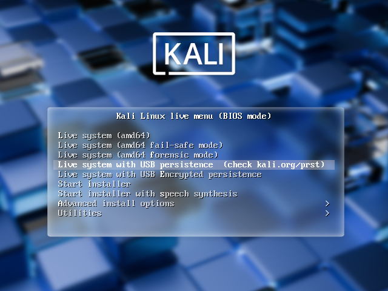
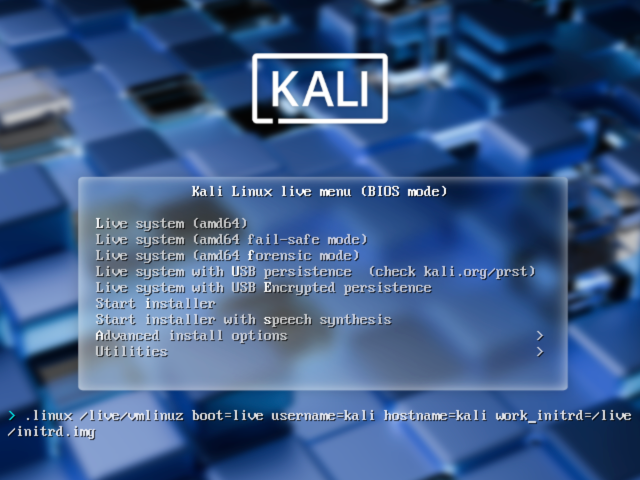

Kali Linux "Live" has two options in the default boot menu which enable persistence - the preservation of data on the "Kali Live" USB drive - across reboots of "Kali Live". You can either do:

- [USB Persistence](/docs/usb/usb-persistence/) (This guide)
- [USB Encrypted Persistence](/docs/usb/usb-persistence-encryption/)

This can be an extremely useful enhancement, and enables you to retain documents, collected testing results, configurations, etc., when running Kali Linux "Live" from the USB drive, even across different systems. The persistent data is stored in its own partition on the USB drive, which can also be optionally LUKS-encrypted.

To make use of the USB persistence options at boot time, you'll need to do some additional setup on your "Kali Linux Live" USB drive; this article will show you how.

This guide assumes that you have already created a Kali Linux "Live" USB drive as described in [the doc page for that subject](/docs/usb/live-usb-install-with-windows/). For the purposes of this article, we'll assume you're working on a Linux-based system.

- - -

{}
You'll need to have root privileges to do this procedure, or the ability to escalate your privileges with `sudo`.
{}

- - -

In this example, we assume:

- Your USB drive is `/dev/sdX` (last letter will probably be different). Check the connected USB drives with the command `lsblk` <!-- Alt: sudo fdisk -l --> and modify the device name in the `usb` variable before running the commands).
- Your USB drive has a capacity of **at least 8GB** - the Kali Linux image takes over 4GB, and for this guide, we'll be creating a new partition to fill up the USB drive to store our persistent data in.

In this example, we'll create a new partition to store our persistent data into, starting right above the second Kali Live partition, put an ext4 file system onto it, and create a `persistence.conf` file on the new partition.

- - -

1. First, begin by imaging the latest Kali Linux live ISO (currently [2025.2](/get-kali/)) to your USB drive as described in [this article](/docs/usb/live-usb-install-with-linux/).

{}
While '/dev/sdX' is used through this page, the '/dev/sdX' should be replaced with the proper device label. '/dev/sdX' will not overwrite any devices, and can safely be used in documentation to prevent accidental overwrites. Please use the correct device label.
{}

We're going to assume that the two partitions created by the imaging are `/dev/sdX1` and `/dev/sdX2`. This can be verified with the command `lsblk`:

```console
kali@kali:~$ lsblk
NAME   MAJ:MIN RM   SIZE RO TYPE MOUNTPOINTS
sda      8:16   0   2.7T  0 disk
├─sda1   8:17   0   512M  0 part /boot/efi
├─sda2   8:18   0   2.7T  0 part /
└─sda3   8:19   0   977M  0 part [SWAP]
sdX      8:32   1  58.4G  0 disk
├─sdX1   8:33   1   4.6G  0 part
└─sdX2   8:34   1     4M  0 part
kali@kali:~$
kali@kali:~$ usb=/dev/sdX
```

- - -

2. Create and format an additional partition on the USB drive.

First, let's create the new partition in the empty space above our Kali Live partitions. We have to do this from the command line as gparted will read the imaged ISO as a large block:

```console
kali@kali:~$ usb=/dev/sdX
kali@kali:~$
kali@kali:~$ sudo fdisk $usb <<< $(printf "p\nn\np\n\n\n\np\nw")
[...]
kali@kali:~$
```

<!--

Alt: sudo fdisk $usb <<< $(printf "n\np\n\n\n\nw")

## Example
```console
kali@kali:~$ sudo fdisk $usb <<< $(printf "n\np\n\n\n\np\nw")

Welcome to fdisk (util-linux 2.40.2).
Changes will remain in memory only, until you decide to write them.
Be careful before using the write command.


Command (m for help): Disk /dev/sdb: 58.44 GiB, 62746787840 bytes, 122552320 sectors
Disk model: Extreme
Units: sectors of 1 * 512 = 512 bytes
Sector size (logical/physical): 512 bytes / 512 bytes
I/O size (minimum/optimal): 512 bytes / 512 bytes
Disklabel type: dos
Disk identifier: 0x6f28db16

Device     Boot   Start     End Sectors  Size Id Type
/dev/sdb1  *         64 9623879 9623816  4.6G 17 Hidden HPFS/NTFS
/dev/sdb2       9623880 9632071    8192    4M  1 FAT12

Command (m for help): Partition type
   p   primary (2 primary, 0 extended, 2 free)
   e   extended (container for logical partitions)
Select (default p): Partition number (3,4, default 3): First sector (9632072-122552319, default 9633792): Last sector, +/-sectors or +/-size{K,M,G,T,P} (9633792-122552319, default 122552319):
Created a new partition 3 of type 'Linux' and of size 53.8 GiB.
Partition #3 contains a ext4 signature.

Command (m for help):
Disk /dev/sdb: 58.44 GiB, 62746787840 bytes, 122552320 sectors
Disk model: Extreme
Units: sectors of 1 * 512 = 512 bytes
Sector size (logical/physical): 512 bytes / 512 bytes
I/O size (minimum/optimal): 512 bytes / 512 bytes
Disklabel type: dos
Disk identifier: 0x6f28db16

Device     Boot   Start       End   Sectors  Size Id Type
/dev/sdb1  *         64   9623879   9623816  4.6G 17 Hidden HPFS/NTFS
/dev/sdb2       9623880   9632071      8192    4M  1 FAT12
/dev/sdb3       9633792 122552319 112918528 53.8G 83 Linux

Command (m for help): The partition table has been altered.
Calling ioctl() to re-read partition table.
Syncing disks.

kali@kali:~$


## Manual

kali@kali:~$ sudo fdisk $usb

Welcome to fdisk (util-linux 2.40.2).
Changes will remain in memory only, until you decide to write them.
Be careful before using the write command.

The device contains 'iso9660' signature and it will be removed by a write command. See fdisk(8) man page and --wipe option for more details.

Command (m for help): n
Partition type
   p   primary (2 primary, 0 extended, 2 free)
   e   extended (container for logical partitions)
Select (default p): p
Partition number (3,4, default 3):
First sector (9632072-122552319, default 9633792):
Last sector, +/-sectors or +/-size{K,M,G,T,P} (9633792-122552319, default 122552319):

Created a new partition 3 of type 'Linux' and of size 53.8 GiB.

Command (m for help): w
The partition table has been altered.
Calling ioctl() to re-read partition table.
Syncing disks.

kali@kali:~$
```
-->

When fdisk completes, the new partition should have been created at `/dev/sdX3`; again, this can be verified with the command `lsblk`:

```console
kali@kali:~$ lsblk
NAME   MAJ:MIN RM   SIZE RO TYPE MOUNTPOINTS
[...]
sdb      8:48   1  58.4G  0 disk
├─sdb1   8:49   1   4.6G  0 part
├─sdb2   8:50   1     4M  0 part
└─sdb3   8:51   1  53.8G  0 part
kali@kali:~$
```

- - -

3. Next, create an **ext4** file system in the partition and label it `persistence`:

```console
kali@kali:~$ usb=/dev/sdX
kali@kali:~$
kali@kali:~$ sudo mkfs.ext4 -L persistence ${usb}3
mke2fs 1.47.2 (1-Jan-2025)
Creating filesystem with 14114816 4k blocks and 3530752 inodes
Filesystem UUID: ccb5cd13-3675-40ac-8b81-a684802a8dd0
Superblock backups stored on blocks:
        32768, 98304, 163840, 229376, 294912, 819200, 884736, 1605632, 2654208,
        4096000, 7962624, 11239424

Allocating group tables: done
Writing inode tables: done
Creating journal (65536 blocks): done
Writing superblocks and filesystem accounting information: done

kali@kali:~$
```

- - -

4. Create a mount point, mount the new partition there, and then create the configuration file to enable persistence. Finally, unmount the partition:

```console
kali@kali:~$ usb=/dev/sdX
kali@kali:~$
kali@kali:~$ sudo mkdir -pv /mnt/my_usb
mkdir: created directory '/mnt/my_usb'
kali@kali:~$
kali@kali:~$ sudo mount -v ${usb}3 /mnt/my_usb
mount: /dev/sdX3 mounted on /mnt/my_usb.
kali@kali:~$
kali@kali:~$ echo "/ union" | sudo tee /mnt/my_usb/persistence.conf
/ union
kali@kali:~$ sudo umount -v ${usb}3
umount: /mnt/my_usb (/dev/sdX3) unmounted
kali@kali:~$
```

- - -

We can now reboot the machine, select to boot from USB then use "Live USB Persistence".
Keep in mind we will need to select this USB boot option every time we wish to have our work stored.

```console
kali@kali:~$ reboot
```



<!--
- You are able to write data anywhere and it will be kept
- Able to mount the partition to see the data: `$ sudo mkdir -pv /mnt/my_usb; sudo mount ${usb}3 /mnt/my_usb; sudo ls -lahR /mnt/my_usb/rw/`
-->

## Multiple Persistence Stores

At this point we should have the following partition structure:

```console
kali@kali:~$ sudo parted /dev/sdX print
Model: SanDisk Extreme (scsi)
Disk /dev/sdX: 62.7GB
Sector size (logical/physical): 512B/512B
Partition Table: msdos
Disk Flags:

Number  Start   End     Size    Type     File system  Flags
 1      32.8kB  4927MB  4927MB  primary               boot, hidden
 2      4927MB  4932MB  4194kB  primary
 3      4933MB  62.7GB  57.8GB  primary

kali@kali:~$
```

We can have multiple persistence stores on the USB drive, both encrypted or not... and choose which persistence store we want to load, at boot time.

Let's delete the previous large partition, which filled up the rest of the drive, and create two additional non-encrypted store. We'll label and call it "work".

- - -

**0x00 - Manage partitions**.

```console
kali@kali:~$ sudo parted /dev/sdX
GNU Parted 3.6
Using /dev/sdX
Welcome to GNU Parted! Type 'help' to view a list of commands.
(parted)
(parted) unit MiB
(parted)
(parted) print
Model: SanDisk Extreme (scsi)
Disk /dev/sdX: 59840MiB
Sector size (logical/physical): 512B/512B
Partition Table: msdos
Disk Flags:

Number  Start    End       Size      Type     File system  Flags
 1      0.03MiB  4699MiB   4699MiB   primary               boot, hidden
 2      4699MiB  4703MiB   4.00MiB   primary
 3      4704MiB  59840MiB  55136MiB  primary

(parted)
(parted) rm 3
(parted)
```

- - -

**0x01 - Create additional partitions**.

We'll create two 5GB (`5000 MiB`) of space:

- Partition 3: `4704 MiB` + `5000 MiB` = `9704 MiB` (Which will hold the "work" data)
- Partition 4: `9704 MiB` + `5000 MiB` = `14704 MiB` (Which will hold the "ctf" data)

```console
(parted) mkpart primary ext4 4704MiB 9704MiB
(parted)
(parted) mkpart primary ext4 9704MiB 14704MiB
(parted)
(parted) print
Model: SanDisk Extreme (scsi)
Disk /dev/sdX: 59840MiB
Sector size (logical/physical): 512B/512B
Partition Table: msdos
Disk Flags:

Number  Start    End       Size     Type     File system  Flags
 1      0.03MiB  4699MiB   4699MiB  primary               boot, hidden
 2      4699MiB  4703MiB   4.00MiB  primary
 3      4704MiB  9704MiB   5000MiB  primary  ext4
 4      9704MiB  14704MiB  5000MiB  primary  ext4

(parted) quit
Information: You may need to update /etc/fstab.

kali@kali:~$
```

- - -

**0x02 - Format and label partitions**:

```console
kali@kali:~$ sudo mkfs.ext4 /dev/sdX3
mke2fs 1.47.2 (1-Jan-2025)
Creating filesystem with 1280000 4k blocks and 320000 inodes
Filesystem UUID: 9920a7b3-7abf-4cfe-9368-02b73edf2c1d
Superblock backups stored on blocks:
	32768, 98304, 163840, 229376, 294912, 819200, 884736

Allocating group tables: done
Writing inode tables: done
Creating journal (16384 blocks): done
Writing superblocks and filesystem accounting information: done

kali@kali:~$
kali@kali:~$ sudo e2label /dev/sdX3 work
kali@kali:~$


kali@kali:~$ sudo mkfs.ext4 -L ctf /dev/sdX4
mke2fs 1.47.2 (1-Jan-2025)
Creating filesystem with 1280000 4k blocks and 320000 inodes
Filesystem UUID: 1ba72717-1485-4e8b-ae7d-ff5b9d81c4b9
Superblock backups stored on blocks:
	32768, 98304, 163840, 229376, 294912, 819200, 884736

Allocating group tables: done
Writing inode tables: done
Creating journal (16384 blocks): done
Writing superblocks and filesystem accounting information: done

kali@kali:~$
```

- - -

**0x03 - Mount these new partitions and create a persistence.conf on them**:

```console
kali@kali:~$ sudo mkdir -pv /mnt/my_usb{3,4}
mkdir: created directory '/mnt/my_usb3'
mkdir: created directory '/mnt/my_usb4'
kali@kali:~$
kali@kali:~$ sudo mount -v /dev/sdX3 /mnt/my_usb3
mount: /dev/sdX3 mounted on /mnt/my_usb3.
kali@kali:~$
kali@kali:~$ sudo mount -v /dev/sdX4 /mnt/my_usb4
mount: /dev/sdX4 mounted on /mnt/my_usb4.
kali@kali:~$
kali@kali:~$ echo "/ union" | sudo tee /mnt/my_usb{3,4}/persistence.conf
/ union
kali@kali:~$ sudo umount -v /mnt/my_usb3 /mnt/my_usb4
umount: /mnt/my_usb3 unmounted
umount: /mnt/my_usb4 unmounted
kali@kali:~$
```

- - -

Now you can you start any system, and set it to start from USB. When the boot menu appears, using the "tab" key, edit the persistence-label parameter to point to your preferred persistence store! We will select our "work" partition:

```console
kali@kali:~$ reboot
```

<!--  -->

<!--  -->


